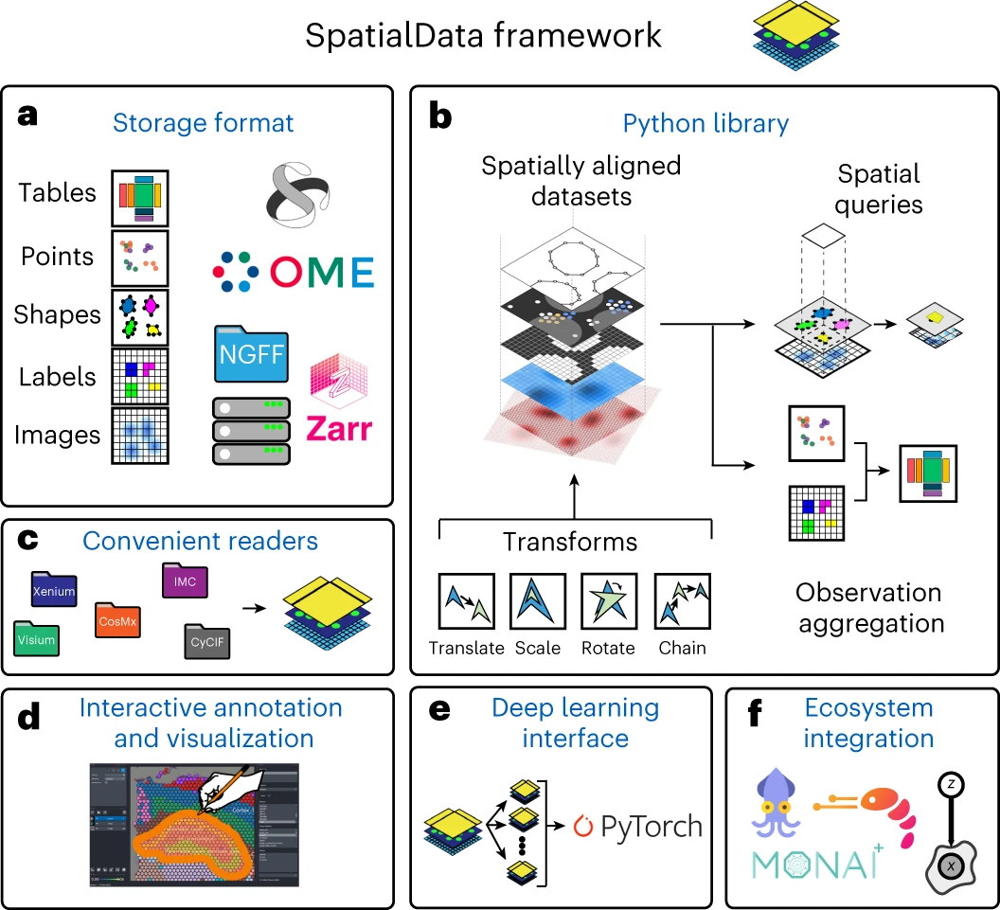

# Data infrastructure {#sec-bkg-data-infrastructure}

## Introduction

Bioconductor provides several data classes for storing and manipulating spatial (transcript)omics datasets. 
By relying on these consistent data structures, we can easily connect methods and packages developed by different research groups to build analysis workflows that include the latest state-of-the-art methods.

<!--
Many of the analysis steps typically performed for single-cell data are – directly or with alterations – applicable to and of potential interest for SO data. 
However, while SO and single-cell data structures share similarities, there’s a need to accommodate specialized information such as spatial coordinates (of observations and/or molecules) and image-related metadata. 
Thus, a container for SO data that extends (or 'inherits from') existing Bioc classes for single-cell data analysis is beneficial in that it can inter-operate with existing infrastructure, and allow technology-specific flexibility in future class and tool development.
-->

Below, we describe the Bioconductor data classes used in this book.


## File formats

Spatial (transcript)omics assays and the data acquired through them are diverse.
In addition, different vendors provide different file formats upon data distributions.
Here, we give an overview of frequently encountered file formats and their handling in R.


### Count data

Data from sequencing-based assays typically include (cell) barcodes and metadata, and a matrix where rows/columns correspond to features/observations.
These are typically provided as a set of *.csv* and *.mtx* files, or compressed versions thereof (e.g. *.gz*).
For data from 10x Genomics, count data can be read into R using `r BiocStyle::Biocpkg("DropletUtils")`'s `read10xCounts()` function; data from other providers can be imported using standard R readers.
For large-scale datasets (say, 100,000s of cells), *.h5* files allow for out-of-memory representation of count matrices, represented as `r BiocStyle::Biocpkg("DelayedArray")`s in R (see `r BiocStyle::Biocpkg("HDF5Array")`).


### *.parquet*

Tabular data (e.g. segmentation boundaries, molecule locations) may arrive in the form of *.parquet* files.
These may be interfaced with using `r BiocStyle::Biocpkg("arrow")`.
Notably, `arrow`'s `read_parquet()` functions allows for delayed `r BiocStyle::CRANpkg("dplyr")`-style operations, such as `filter()` and `select()`, allowing to query the data in a delayed fashion in order to, e.g., import only relevant parts into memory.


### *.zarr*

*.zarr* stores can be used to store N-dimensional arrays as a grid of "chunks", enabling parallelizable accession.
For (bio)imaging data, different image scales (or resolutions) can be stored as different layers of a "pyramid", where the base/tip represents the full/lowest resolution.
R-interfaces to *.zarr* are provided through `r BiocStyle::Biocpkg("Rarr")` (Bioconductor) and `r BiocStyle::CRANpkg("pizzarr")` (CRAN).


## Data classes

In sequencing-based ST data, measurements come in the form of a transcripts-by-spots count matrix, where each spot is additionally associated with spatial coordinates.

By contrast, imaging-based ST technologies yield molecule-level data that are typically provided as long-format tables where each row corresponds to an observation, and columns contain information about transcript identity, spatial location, and experimental metadata (e.g. sample of origin). 
Upon segmentation of cell boundaries and subsequent transcript-to-cell mapping, these data can be reshaped into a transcripts-by-cells count matrix that is analogous to data from single-cell omics technologies. 

For both types of data, observations are associated with additional metadata such as area size of spots or of segmented cells and, for the latter, centroid locations and polygonal boundaries from segmentation.


### Bioconductor-based

#### SingleCellExperiment

Single-cell RNA-seq and analogous technologies quantify transcripts at single-cell resolution, yielding a transcripts-by-cells count matrix.
In Bioconductor, the primary class for data from single-cell experiments is `r BiocStyle::Biocpkg("SingleCellExperiment")` [@Amezquita2020] (SCE).

SCE extends the `r BiocStyle::Biocpkg("SummarizedExperiment")` (SE) class by a series of features specific to single-cell data.
For instance, `reducedDims` for low-dimensional embeddings of observations such as PCA, t-SNE, and UMAP; `row`- and `colPairs` for relationships between genes (e.g. gene-to-gene correlations) and cells (e.g. cell-to-cell distances), respectively; and, data on alternative features from the same cells, such as those obtained via multi-modal assays, are stored as `altExps` (for 'alternative experiments').


#### SpatialExperiment

`r BiocStyle::Biocpkg("SpatialExperiment")` (SPE) [@Righelli2022] is the core data class used in this book. 
This class allows us to store datasets at the spot or cell level, i.e. data from sequencing-based platforms at the spot level, or data from imaging-based platforms aggregated to the cell level.

SPE extends SCE with additional customizations to store spatial information, such as spatial coordinates and image files.
A schematic of the `SpatialExperiment` object structure is shown in @fig-spe. 
Briefly, a SPE object consists of (i) `assays` containing expression counts, (ii) `rowData` containing information on features, i.e. genes, (iii) `colData` containing information on spots or cells, including non-spatial and spatial metadata, (iv) `spatialCoords` containing spatial coordinates, and (v) `imgData` containing image data. 
For spot-based data, a single `assay` named `counts` is used.

```{r fig-spe, echo = FALSE, out.width = "80%", fig.cap = "Overview of the `SpatialExperiment` data class for storing and manipulating spatial transcriptomics datasets within the Bioconductor framework."}
knitr::include_graphics("../images/SpatialExperiment.png")
```


#### SpatialFeatureExperiment

SPE has been extended through `r BiocStyle::Biocpkg("SpatialFeatureExperiment")` (SFE) [@Moses2023-Voyager], which can additionally accommodate observation- and feature-level graphs (e.g. of cell/spot neighborhoods) and geometries (e.g. segmentation and tissue boundaries, or histological regions annotated by a pathologist).
Because these are represented as `r BiocStyle::CRANpkg("sf")` (geometries) and `r BiocStyle::CRANpkg("spdep")` (graphs) objects, SFE directly gives access to a range of geometry operations (e.g. intersecting and buffering) and spatial dependency calculations (e.g. Moran's I and Geary's C).


#### MoleculeExperiment

`r BiocStyle::Biocpkg("MoleculeExperiment")` (ME) [@PetersCouto2023-MoleculeExperiment] is designed for imaging-based spatial transcriptomics data.
For each sample, ME stores a list of `molecules` (e.g. transcript identities and coordinates), and `boundaries` (e.g. cell identities and polygon coordinates).
The latter can, in principle, contain alternative segmentations that may stem from, e.g., cell membrane, body, or nucleus stainings.
In this way, different count matrices may be obtained by allocating molecules to a given set of boundaries.
Analyses at the aggregated cell level may, in turn, be carried out using an ME-derived SPE (the ME package provides a wrapper for this).


### Non-Bioconductor-based

There are several other frameworks outside Bioconductor that support spatially-aware analysis for both sequencing- and imaging-based platforms. `r BiocStyle::Githubpkg("satijalab/seurat")` and `scanpy` [@Wolf2018-scanpy] provide comprehensive single-cell analysis pipelines in R and Python, respectively, and incorporate features to visualize and analyze spatial omics datasets. Packages including `r BiocStyle::Githubpkg("drieslab/Giotto")` [@Chen2023-Giotto] (R), `r BiocStyle::Githubpkg("BIMSBbioinfo/VoltRon")` (R) [@Manukyan2023-VoltRon], and `squidpy` (Python) [@Palla2022-squidpy] support all-in-one frameworks for analyzing spatial omics data and contain extensive sets of spatially-aware algorithms.


#### Giotto

`r BiocStyle::Githubpkg("drieslab/Giotto")` [@Chen2023-Giotto] (or Giotto Suite) provides tools to process, analyze and visualize spatial multi-omics data at multiple scales and resolutions. The package supports the analysis of an extensive set of sequencing- and imaging-based platforms with either transcriptomics and proteomics modailities such as Xenium, Visium HD and CODEX (Akoya). `Giotto` provides utilities to manipulate spatial objects and images, detect spatial patterns and spatially-aware clusters, and support database-based backed data using `r BiocStyle::Githubpkg("drieslab/dbverse")` for scalability.


#### VoltRon

The `r BiocStyle::Githubpkg("BIMSBbioinfo/VoltRon")` package incorporates a framework that allows spatially-aware alignment between datasets with observations that span across regions of interest (ROIs) and image tiles in addition to cells, spots, and molecules. `Shiny` applications are provided to conduct both automated and manual spatial alignment across adjacent tissue sections where users can interactively manage images and choose landmark points for co-registration. `VoltRon` is also an end-to-end spatial omics analysis package, and support on-disk representations of spatially-resolved datasets using *.zarr* and *.h5* backed `r BiocStyle::Biocpkg("DelayedArray")` objects.


#### SpatialData

The [`SpatialData`](https://spatialdata.scverse.org) [@Marconato2025-SpatialData] framework (@fig-spd) offers a suite of modules for loading, handling, as well as (static and interactive) visualization of diverse spatial omics data (spanning imaging- and sequencing-based data and different modalities).
In essence, the container relies on 5 types of elements (images, labels, shapes, points, and tables), which are represented on-disk using standardized, OME-NGFF compliant file formats (*.zarr* for images, labels, and tables; *.parquet* for shapes and polygons), enabling unified and memory-efficient data representation and handling.

```{r fig-spd, echo = FALSE, out.width = "80%", fig.cap = "Overview of the scverse/Python `SpatialData` framework."}

```


## Commercial solutions

- Bruker's [AtoMx](https://nanostring.com/products/atomx-spatial-informatics-platform/atomx-sip-overview/) is a cloud-based platform for both interactive visualization and GUI-based analysis (*"No coding experience is required to use AtoMx SIP."*). AtoMx can execute pipelines built from both custom and pre-configured modules, and incorporates Bruker's multi-modal segmentation algorithm. The platform is integrated with CosMx SMI instruments, i.e. data is available through AtoMx upon acquisition.

- 10x Genomics's [Loupe Browser](https://www.10xgenomics.com/support/software/loupe-browser/latest) is a visualization software application for Visium, Visium HD, and other single-cell and multiome data by 10x Genomics. The complementary `r BiocStyle::Githubpkg("10XGenomics/loupeR")` package allows for coercion of `r BiocStyle::Githubpkg("satijalab/seurat")` objects (and, in turn, `r BiocStyle::Biocpkg("SummarizedExperiment")`-derived classes) into Loupe Browser-compliant files. Histopathological annotation of CytAssist images is also supported.

- Vizgen's [Visualizer](https://vizgen.com/vizualizer-software/) is included with the MERSCOPE instrument purchase. It allows for interactive visualization of segmentation boundaries, transcripts, and proteins; can incorporate external analysis results (e.g. clustering, dimensionality reduction); and, supports annotating and exporting regions of interest for downstream analysis.

- 10x Genomics's [Xenium Explorer](https://www.10xgenomics.com/support/software/xenium-explorer/latest) is a desktop application (for Mac and Windows) that enables interactive visualization; can incorporate third-party results (e.g. cell metadata, other segmentations); annotating and exporting regions of interest; and, registering post-Xenium images. The application is limited to data generated by the Xenium Analyzer instrument.


## Appendix

### References {.unnumbered}
