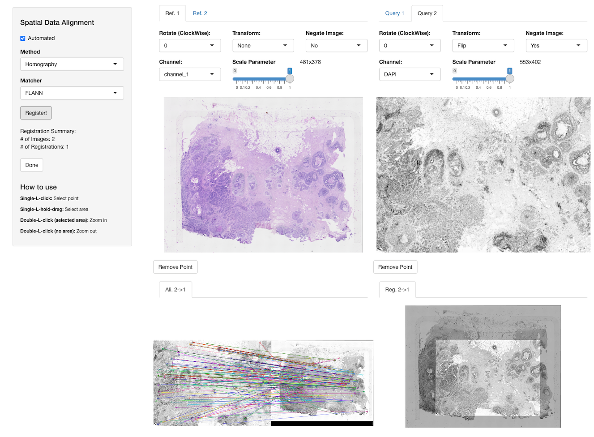
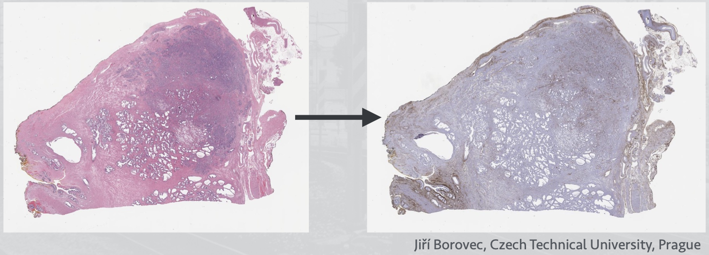
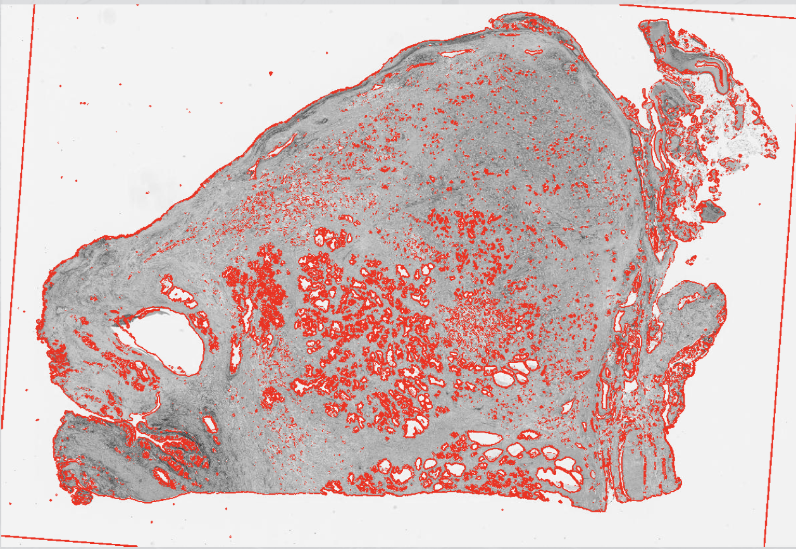
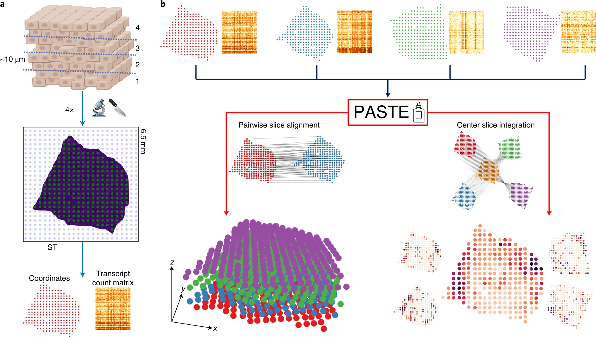

# Spatial registration {#sec-crs-spatial-registration}



## Preamble

### Introduction

Spatial registation is defined as the task of mapping features or spatial locations of observations from a *query* to a *reference* assay [@Friston1995-registration; @Lewis2021-spatial-omics; @Nitzan2019-novoSpaRc]. 
Here, the reference is a spatially-resolved dataset whereas the query could be an assay with or without spatial resolution. 

In this chapter, we demonstrate methods that are available in R/Bioconductor for aligning (or registering) spatially-resolved datasets, where the utility and function of the alignment method is defined by the modality of the query dataset. 

We will touch upon two cases: 
(1) *alignment*, where both reference and query data are spatially resolved; and, 
(2) *reconstruction*, where spatial information is inferred from non-spatial data.

### Dependencies

```{r load-libs, message=FALSE, warning=FALSE}
library(ggspavis)
library(OSTA.data)
library(SpatialExperiment)
library(SpatialExperimentIO)
```

In this demo, we will use the Xenium data generated from a human breast cancer biopsy [@Janesick2023-high-res], which is available from `r BiocStyle::Biocpkg("OSTA.data")` (see @sec-bkg-example-datasets):

```{r load-data, message=FALSE, warning=FALSE}
# retrieve dataset from OSF repo
id <- "Xenium_HumanBreast1_Janesick"
pa <- OSTA.data_load(id, mol=FALSE)
dir.create(td <- tempfile())
unzip(pa, exdir=td)
# read into 'SpatialExperiment'
xen <- readXeniumSXE(td, addTx=FALSE)
xen$sample_id <- "Xenium"
xen
```

## Alignment

Spatial omic technologies often generate data modalities that capture morphological features of tissue sections as well as omic profiles of cells, spots or other types of observations.
Localization of these profiles can also be defined in different units and even in different perspectives (i.e., coordinate systems). 
Image alignment and registration methods provide transformations to map spatial locations of observations from one coordinate system to another, thus allowing to transfer data across observations from identical tissue sections, adjacent sections, as well as sections with similar morphology and structure.

Strategies and approaches for aligning spatial omic assays differ depending on the modalility and/or instrument used to generate these data. 
These methods could be categorized into two classes, where some incorporate 
**(i)** the morphology of microscopy images (*image registration*) of reference and query data [@Friston1995-registration] and others that rely on the
**(ii)** spatial locations of observations (cells or spots) and the distribution of omic profiles (*omics coverage*) [@Kiessling2024-spatial-multi-omics].

### Image-based

To facilitate alignment using images, we will showcase how to incorporate `r BiocStyle::Githubpkg("BIMSBBioinfo/VoltRon")` to align a `r BiocStyle::Biocpkg("SpatialExperiment")` object of Xenium data with a post-Xenium hematoxylin and eosin (H&E) stain of the same tissue section.

The `SpatialExperiment` of the Xenium data does not include any images. 
To perform the spatial alignment via image registration, we first add an image of the corresponding DAPI staining to the object's `imgData`.
[*ome.tiff*s of full-resolution DAPI and H&E stains are available at [GSM7780153](https://www.ncbi.nlm.nih.gov/geo/query/acc.cgi?acc=GSM7780153).]{.aside}

The `r BiocStyle::Biocpkg("RBioFormats")` package can be used to read a specific resolution from multi-resolution *ome.tiff* image pyramids.
Here, we choose the lowest resolution of the `morphology_mip.ome.tif` from the standard Xenium output. 
We also define the parameter (pixel-to-micron ratio) to scale the spatial coordinates of cells accordingly:
[For more information on image scale factors, see [here](https://kb.10xgenomics.com/hc/en-us/articles/11636252598925-What-are-the-Xenium-image-scale-factors).]{.aside}

```{r read-dapi, eval=FALSE}
res <- 7 # target resolution
px <- 0.2125 # px size (um)
sf <- px*(2^(res-1)) # scale factor
img <- RBioFormats::read.image(
    "morphology_mip.ome.tif", 
    resolution=res)
```

Before adding the selected DAPI image to the `SpatialExperiment` object, we first 
normalize the contrast to 1, and then save the image to a temporary `.png` file:

```{r save-dapi, eval=FALSE}
img <- img/max(img)
png <- "Xenium_DAPI_res7.png"
EBImage::writeImage(img, files=png, type="png")
```

```{r load-dapi, echo=FALSE}
res <- 7; px <- 0.2125; sf <- px*(2^(res-1))
png <- "../images/crs-registration-Xenium_DAPI_res7.png"
```

We can now add the DAPI channel to the `SpatialExperiment` object:

```{r add-dapi, message=FALSE, warning=FALSE}
xen <- addImg(xen, 
    sample_id="Xenium", 
    image_id="DAPI",
    imageSource=png, 
    scaleFactor=1/sf,
    load=TRUE)
imgData(xen)
```

Let's visualize the new DAPI image and overlay with cell centroids using `r BiocStyle::Biocpkg("ggspavis")`:

```{r plt-dapi, fig.width=5, fig.height=4}
# plot DAPI image
p <- plotVisium(xen, spots=FALSE, image_id="DAPI")
# overlay cells with image
img <- imgRaster(xen)
sf <- scaleFactors(xen)
xy <- spatialCoords(xen)*sf
xy[, 2] <- nrow(img)-xy[, 2]
p + geom_point(
    aes(x_centroid, y_centroid), data.frame(xy),
    shape=16, stroke=0, size=0.2, alpha=0.4, 
    col="red", inherit.aes=FALSE) 
```

At this stage, one may use `VoltRon` (or another tool) in order to register the query spatial data onto the reference (in this example, query = cell centroids, reference = H&E staining).

The return value of `VoltRon`'s `registerSpatialData()` function includes an affine transformation matrix that may be used to register spatial coordinates:

```{r mtx}
# affine transformation matrix generated
# by 'VoltRon::registerSpatialData()'
mtx <- matrix(ncol=3, byrow=TRUE, c(
    5.839057e-01, -2.542718e-03, 94.00896, 
    2.372556e-03, 5.848592e-01, 105.44208, 
    -1.500111e-06, 3.715999e-06, 1.00000))
```

An affine map is generally composed of a linear map (scaling and rotation) 
and a translation, and can be apply using basic matrix multiplication and 
vector addition, specifically:

$$\mathbf{y}=A\mathbf{x}+\mathbf{b}$$

where $A$ denotes the linear map, $b$ the translation, and $\mathbf{x}$ and 
$\mathbf{y}$ correspond to original and transformed coordinates, respectively.

In R, this translates to the following operations:

```{r reg}
img <- imgRaster(xen)
xy <- spatialCoords(xen)
xy <- xy*scaleFactors(xen)
xy[, 2] <- nrow(img) - xy[, 2]
xy_reg <- t(mtx %*% rbind(t(xy), 1))
xy_reg <- xy_reg[, -3]
colnames(xy_reg) <- colnames(spatialCoords(xen))
# create a dataset copy with new coordinates
reg <- xen
imgData(reg) <- NULL
spatialCoords(reg) <- xy_reg
```

Now that the registered Xenium data and the post-Xenium H&E image have identical coordinate systems, we can add the H&E image directly to the registered `SpatialExperiment` object: 

```{r read-save-hne, eval=FALSE}
tif <- "GSM7780153_Post-Xenium_HE_Rep1.ome.tif"
img <- RBioFormats::read.image(tif, resolution=7)
png <- "Xenium_H&E_res7.png"
EBImage::writeImage(tif, files=png, type="png")
```

```{r load-hne, echo=FALSE}
png <- "../images/crs-registration-Xenium_H&E_res7.png"
```

```{r add-hne}
reg <- addImg(reg, 
    sample_id="Xenium", 
    image_id="H&E", 
    imageSource=png, 
    scaleFactor=1, 
    load=TRUE)
imgData(reg)
```

Again, we can visualize the registered Xenium cells on the H&E image:

```{r plt-hne, fig.width=5, fig.height=4}
# plot H&E image
p <- plotVisium(reg, spots=FALSE, image_ids="H&E")
# overlay cells with image
img <- imgRaster(reg)
sf <- scaleFactors(reg)
xy <- spatialCoords(reg)*sf
xy[, 2] <- nrow(img)-xy[, 2]
p + geom_point(
    aes(x_centroid, y_centroid), data.frame(xy),
    shape=16, stroke=0, size=0.2, alpha=0.4, 
    col="red", inherit.aes=FALSE)
```

::: {.callout-note collapse="true" title="Other methods"}

A number of R/Python frameworks can be used to automatically or manually align microscopy images associated with spatial omic datasets. The Python modules could be used through R packages such as `r BiocStyle::Biocpkg("reticulate")` and `r BiocStyle::Biocpkg("basilisk")`.

- `r BiocStyle::Githubpkg("BIMSBbioinfo/VoltRon")` [@Manukyan2023-VoltRon] is an R package that allows alignment between multiple spatially aware datasets of distinct modalities. A Shiny application is provided to enable both automated and manual alignment across adjacent/same tissue sections where users can interactively manipulate microscopy images and choose landmarks points for co-registration.

{width="75%" fig-align="center" alt="The Shiny application interface for alignment Spatial datasets stored in VoltRon objects"}

- `r BiocStyle::CRANpkg("RNiftyReg")` is an R wrapper package, and can be combined with `r BiocStyle::CRANpkg("mmand")` for [automated image registration](https://user2015.math.aau.dk/presentations/46.pdf) using both rigid and non-rigid approaches. Users can extract and apply the resulting transformation matrix on spatial coordinates of a `SpatialExperiment` object. However, the automation does not work well on images with very different orientation, scale, and intensity (e.g., Xenium and Visium; see also @sec-crs-workflow-xenvis). Here is a demonstration with external data, before and after registration of the two slices:

<center>
{width=66%}
{width=33%}
</center>

- `r BiocStyle::Githubpkg("JEFworks-Lab/STalign")` [@Clifton2023-STalign] is a Python module that performs optimal transport across two sets of spatial coordinates with or without associated microscopy images. Rasterization of spatial coordinates could be performed when the one of either query and reference assay missing any background microscopy images with, e.g. H&E and/or DAPI staining. 

- `r BiocStyle::Githubpkg("scverse/spatialdata")` [@Marconato2025-SpatialData] is a Python framework, maintained by the [scverse](https://scverse.org/) consortium. Combined with the [*napari*](https://napari.org/stable/) platform, `spatialdata` allows users to manually select landmark points before performing rigid alignment between two objects. Here we show the registration of Visium onto Xenium in *napari*:

<center>
{width=50%}
</center>

:::

### Omics-based

Spatial alignment approaches that depend only on the spatial distribution of omic profiles 
are mostly available in Python frameworks which could be used in R through packages 
such as `r BiocStyle::Biocpkg("reticulate")` and `r BiocStyle::Biocpkg("basilisk")`.

- **PASTE** is a Python-based framework [@Zeira2022-PASTE] that perform pairwise alignment 
between serial sections by solving a fused Gromov–Wasserstein optimal transport problem. 
The solution finds a mapping between each pair of adjacent slices by minimizing a transport 
cost that depends on both gene expression profiles and distance between spots of each slice.

{width="75%" fig-align="center" alt="The Shiny application interface for alignmening spatial datasets stored in `VoltRon` objects."}

- **SLAT** is another alternative provided as a Python module 
[scSLAT](https://github.com/gao-lab/SLAT) [@Xia2023-SLAT] that jointly models 
spatial coordinates and omics features using spatial graph with node embeddings. 
Here, the node embeddings are generated by batch-corrected embeddings of omics features 
whereas the graph is constructed using edges detected by either kNN or radial neighbors. 
The solution is found by minimizing the cost of a bipartite matching problem. 

## Reconstruction

We now move to the second case where the query dataset includes no spatial 
information, and where we instead would like to leverage spatially-resolved 
reference data in order to 'reconstruct' the spatial coordinates of query single cells. 

Below we give a list of Python frameworks that reconstruct the spatial locations of 
single-cell profiles. Some of these methods could be used through R using packages such as 
`r BiocStyle::Biocpkg("reticulate")` and `r BiocStyle::Biocpkg("basilisk")`.

- `r BiocStyle::Githubpkg("QihuangZhang/CeLEry")` [@Zhang2023-CeLEry] incorporates a supervised deep neural network model to learn the relationship between spot/cell profiles of spatial omics data and associated localization information, and then uses this model to predict the localization of single cell profiles by using the scRNAseq data as input.

- `r BiocStyle::Githubpkg("rajewsky-lab/novosparc")` [@Nitzan2019-novoSpaRc] utilizes optimal transport (OT) to find a probabilistic embedding between expression space and physical space of single cells that minimizes the discrepancy between the pairwise graph-based distances in both of these spaces.

- `r BiocStyle::Githubpkg("zcang/SpaOTsc")` [@Cang2020-SpaOTsc] also reconstructs the spatial localization of single-cell profiles by solving an OT problem. Three distance matrices are calculated which are associated with the dissimilarities between spot/cell profiles within and across two datasets, where one is a scRNAseq and the other is a spatial omics dataset. The solution to the unbalanced and structured OT problems returns an OT plan for mapping single-cell profiles to spatial locations.


## Appendix

### References {.unnumbered}


