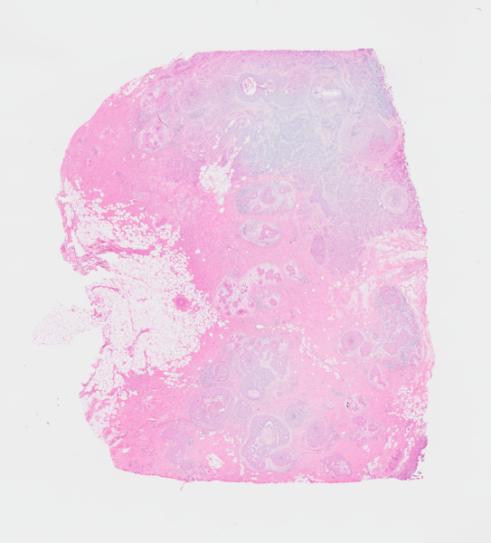

# Workflow: Xenium + Visium {#sec-crs-workflow-xenvis}



## Preamble

### Dependencies

```{r dep, message=FALSE, warning=FALSE}
library(RANN)
library(scater)
library(scuttle)
library(harmony)
library(ggspavis)
library(VisiumIO)
library(patchwork)
library(OSTA.data)
library(BayesSpace)
library(SpatialExperiment)
library(SpatialExperimentIO)
# set seed for random number generation
# in order to make results reproducible
set.seed(194849)
```

### Introduction

In this demo, we will rely on a dataset from @Janesick2023-high-res, which includes
same-section Visium and Xenium measurements on human breast cancer tissue.

{height=300px}
{height=300px}

## Setup {#sec-crs-workflow-xenvis-load-data}

We start out by retrieving these datasets from the OSF repository, and reading 
them into R as separate `r BiocStyle::Biocpkg("SpatialExperiment")` objects:

```{r load-data, message=FALSE, warning=FALSE}
# Visium
id <- "Visium_HumanBreast_Janesick"
pa <- OSTA.data_load(id)
dir.create(td <- tempfile())
unzip(pa, exdir=td)
obj <- TENxVisium(
    spacerangerOut=file.path(td, "outs"), 
    images="lowres", 
    format="h5")
(vis <- import(obj))
# Xenium
id <- "Xenium_HumanBreast1_Janesick"
pa <- OSTA.data_load(id, mol=FALSE)
dir.create(td <- tempfile())
unzip(pa, exdir=td)
(xen <- readXeniumSXE(td, addTx=FALSE))
# also retrieve cell subpopulation labels
df <- read.csv(file.path(td, "annotation.csv"))
xen$anno <- df$Annotation[match(xen$cell_id, df$Barcode)]
```

We'll also do some data wrangling to simplify spatial coordinate names, and use
gene symbols (rather than ensembl identifiers) as feature names for both data:

```{r prep-data}
# simplify spatial coordinate names
spatialCoordsNames(vis) <- spatialCoordsNames(xen) <- c("x", "y")
# use gene symbols as feature names
rownames(vis) <- make.unique(rowData(vis)$Symbol)
rownames(xen) <- make.unique(rowData(xen)$Symbol)
```

## Alignment

To align Xenium and Visium sections, we use the affine transformation matrix 
provided by 10x Genomics, which was obtained by registration of Xenium onto 
Visium in Python with the [Fiji Java plug-in](https://www.10xgenomics.com/resources/analysis-guides/he-to-xenium-dapi-image-registration-with-fiji); see
@sec-crs-spatial-registration for details.

```{r mtx}
# affine matrix for aligning Xenium onto Visium
mtx <- matrix(nrow=2, byrow=TRUE, c(
    8.82797498e-02, -1.91831377e+00, 1.63476055e+04,
    1.84141210e+00,  5.96797885e-02, 4.12499099e+03),
    dimnames=list(c("x", "y"), c("x", "y", "z")))
```
  
```{r new-xy}
# stash original coordinates
old <- spatialCoords(xen)
colData(xen)[c(".x", ".y")] <- old
# apply affine transformation
new <- old %*% t(mtx[, -3]) # scale/rotate &
new <- sweep(new, 2, mtx[, 3], `+`) # offset
spatialCoords(xen) <- new
```

```{r plt-xy, fig.width=3, fig.height=3}
#| code-fold: true
df <- data.frame(spatialCoords(vis))
fd <- data.frame(spatialCoords(xen))
ggplot() + coord_equal() + theme_void() +
    geom_point(aes(x, y), df, col="grey", stroke=0, size=1) +
    geom_point(aes(x, y), fd, col="blue", stroke=0, size=0.1) 
```

## Aggregation

Binning single-cell resolution spatial data into spots can be useful for checking 
correlations between technical replicates of the same technology, identifying 
artifacts across technologies, and checking cell density (number of cells per spot). 
In general, it is possible to bin at the transcript-level (sub-cellular) or cell-level.

To aggregate single cell-level data from Xenium at the spot level, we first 
carry out a fixed-radius neighborhood search using `r BiocStyle::CRANpkg("RANN")` 
(see @sec-img-neighborhood-analysis) to identify, for every spot, cells whose centroid lies 
within a $\sim130$um distance (Visium spot diameter of 55um, divided by two 2, 
divided by 0.2115 = Xenium px size in um):

```{r nns, message=FALSE, fig.width=3.5, fig.height=3}
# do a fixed-radius search to get cell 
# centroids that fall on a given spot
nns <- nn2(
    searchtype="radius", radius=55/2/0.2125, k=200,
    data=spatialCoords(xen), query=spatialCoords(vis))
```

Let's count and visualize the number of cells that overlap each spot:

```{r plt-ncs, message=FALSE, fig.width=3.5, fig.height=3}
# get cell indices and number of cells per spot
vis$n_cells <- rowSums((idx <- nns$nn.idx) > 0)
plotCoords(vis, annotate="n_cells")
```

Next, we can aggregate single cell-level Xenium data into pseudo-spots. 
In addition, we propagate the Visium data's spatial coordinates, 
excluding spots without any overlapping cells:

```{r pbs, message=FALSE, fig.width=3, fig.height=3}
# aggregate Xenium data into pseudo-spots
xem <- aggregateAcrossCells(xen[, c(t(idx))], rep.int(seq(ncol(vis)), vis$n_cells))
# propagate Visium data's spatial coordinates, excluding empty pseudo-spots
spatialCoords(xem) <- spatialCoords(vis)[vis$n_cells > 0, ] 
colnames(xem) <- colnames(vis)[vis$n_cells > 0]
xem$in_tissue <- 1
```

Because we've aligned the Xenium to the Visium data, we can also 
propagate the Visium data's `imgData` (low resolution H&E staining) 
to the object containing pseudo-spot Xenium data:

```{r img}
imgData(xem) <- imgData(vis)
```

Next, let's compute some standard quality control metrics on both, 
the Visium and pseudo-spot Xenium data. Besides dataset-specific metrics, 
we also specify the subset of genes that are shared between both datasets 
in order to obtain comparable metrics:

```{r qcs}
sub <- list(gs=intersect(rownames(vis), rownames(xen)))
vis <- addPerCellQCMetrics(vis, subsets=sub)
xem <- addPerCellQCMetrics(xem, subsets=sub)
```

Let's visually compare the total counts per (pseudo-)spot between Visium and Xenium:

```{r plt-sum, fig.width=7, fig.height=3}
plotVisium(vis, 
    annotate="subsets_gs_sum",
    zoom=TRUE, facets=NULL) +
    ggtitle("Visium") +
plotVisium(xem, 
    annotate="subsets_gs_sum",
    zoom=TRUE, facets=NULL) +
    ggtitle("Xenium") +
plot_layout(nrow=1) 
```

We can also use a scatter plot - where points = (pseudo-)spots - 
to directly compare total counts between both technologies:

```{r plt-pts, collapse=TRUE, fig.width=4.5, fig.height=4}
df <- data.frame(
    n_cells=xem$ncells,
    Xenium=xem$subsets_gs_sum,
    Visium=vis[, colnames(xem)]$subsets_gs_sum)
ggplot(df, aes(Xenium, Visium, col=n_cells)) + 
    scale_color_gradientn(colors=rev(hcl.colors(9, "Mako"))) +
    geom_point(alpha=0.5) + theme_bw() + theme(aspect.ratio=1) 
```

## Integration

Besides physically aligning both datasets, we can integrate them on 
a transcriptional level; here, using `r BiocStyle::Biocpkg("harmony")`.

To this end, we first consolidate the Visium and Xenium data into one object:

```{r obj}
# pool datasets together
gs <- intersect(rownames(vis), rownames(xem))
cs <- intersect(colnames(vis), colnames(xem))
cd <- intersect(names(colData(vis)), names(colData(xem)))
lys <- list(Visium=vis, Xenium=xem)
lys <- mapply(spe=lys, sid=names(lys), \(spe, sid) {
    spe <- spe[gs, cs]
    spe$sample_id <- sid
    rowData(spe) <- NULL
    colData(spe) <- colData(spe)[cd]
    assay(spe) <- as(assay(spe), "dgCMatrix")
    return(spe)
}, SIMPLIFY=FALSE)
(obj <- do.call(cbind, lys))
```

In order to perform joint spatial clustering of both modalities, we construct
array coordinates for Xenium pseudo-spots that are offset from Visium spots:

```{r offset}
# offset the spatial location for joint clustering
# of Visium and adjacent pseudo-spot Xenium data
obj$array_row <- c(ar <- vis[, cs]$array_row, 100+ar)
obj$array_col <- c(ac <- vis[, cs]$array_col, 100+ac)
```

Next, we run a standard pipeline to perform log-library size normalization 
(using `r BiocStyle::Biocpkg("scater")`), principal component analysis (PCA), 
`harmony` integration, and dimension reduction (UMAP). Notably, the feature 
selection step that typically precedes PCA is skipped here, as the Xenium 
experiment includes only a curated selection of $\sim300$ targets by design.

```{r int}
# minimal filtering
obj <- obj[, obj$subsets_gs_sum > 0]
# library size normalization 
obj <- logNormCounts(obj)
# principal component analysis
# (w/o additional feature selection)
obj <- runPCA(obj)
# 'harmony' integration
pcs <- RunHarmony(
    data_mat=reducedDim(obj, "PCA"), 
    meta_data=obj$sample_id, 
    verbose=FALSE)
reducedDim(obj, "PCA") <- pcs
# dimensionality reduction
map <- calculateUMAP(t(pcs))
reducedDim(obj, "UMAP") <- map
```

```{r plt-map, fig.width=3.5, fig.height=3}
plotUMAP(obj, colour_by="sample_id", point_size=0.1) +
    guides(col=guide_legend(override.aes=list(alpha=1, size=2))) +
    theme_void() + theme(aspect.ratio=1, legend.key.size=unit(0, "pt"))
```

## Clustering

The `spatialCluster()` function clusters the spots, and adds the predicted cluster 
labels to the object. The authors recommend running with at least 10,000 iterations 
(`nrep=1e4`); we use fewer iterations in this demo for the sake of runtime. (Note 
that a random seed must be set (`set.seed()`) for the results to be reproducible.)

```{r clu, message=FALSE}
# 'BayesSpace' clustering
res <- spatialCluster(obj, q=10, burn.in=100, nrep=1e3)
table(res$k <- factor(res$spatial.cluster))
```

We see high concordance between the two modalities, although the 
aggregated Xenium data appears to yield slightly higher granularity:

```{r plt-clu, collapse=TRUE, fig.width=4, fig.height=2.5}
plotVisium(res, 
    image=FALSE, annotate="k") +
    theme(legend.key.size=unit(0, "pt"))
```

From here on out, both datasets could be analyzed together and/or independently, 
e.g., in order to identify cluster markers, annotate cell subpopulations etc.


## Appendix

### References {.unnumbered}


