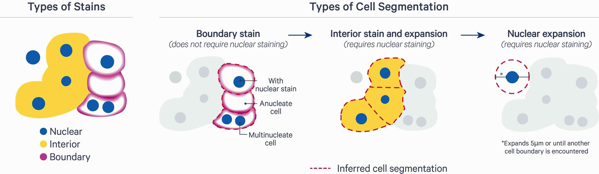
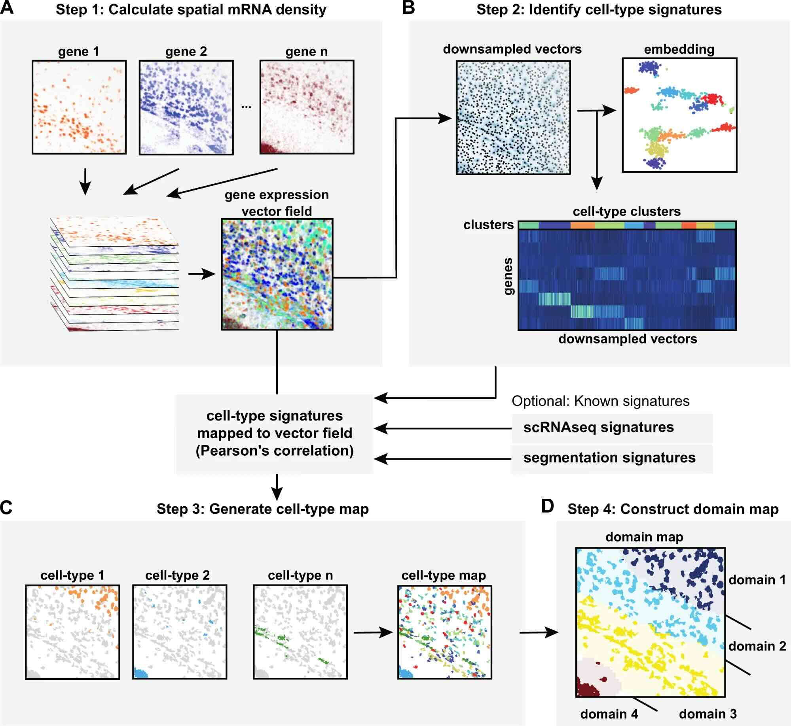

# Segmentation {#sec-img-segmentation}

## Introduction

Standard imaging-based ST data analysis pipelines rely on microscopy stains to estimate boundaries (e.g., nucleus or cellular membrane), and assign molecular readouts to their cell of origin. Such readouts can be discrete points (e.g., molecule locations) or continuous distributions (e.g., fluorescent intensities); for the latter, a decision with regards to summarizations needs to be made (e.g., mean or median). The resulting measurement matrix of features (e.g., genes or proteins) $\times$ observations (e.g., cells or spots) forms the basis for numerous analysis tasks.

## Common algorithms

**Image-based.** `r BiocStyle::Githubpkg("MouseLand/cellpose")` [@Stringer2021-cellpose] is a deep learning-based method that utilizes a flow-based representation of cell morphology to identify and delineate cells across diverse microscopy images.
It has been pre-trained on a large dataset of various cell types, allowing it to generalize well without requiring extensive parameter tuning or retraining.
With a user-friendly interface, the ability to handle irregular and overlapping cells, and support for both automatic and user-assisted segmentation, Cellpose is a versatile tool widely used in biomedical imaging and quantitative cell analysis.

**Hybrid.** `r BiocStyle::Githubpkg("kharchenkolab/Baysor")` [@Petukhov2021-Baysor] has a CLI, and is also available as a Julia package. 
It takes a probabilistic approach that is based on Markov random fields (MRFs) and uses expectation-maximization (EM) for optimization. 
A variety of information -- e.g., fluorescent stains (e.g., nuclei staining via DAPI), expression profiles from scRNA-seq reference data etc. -- can be incorporated as priors. 
Yet, Baysor can perform segmentation using transcript information (i.e., location and identity) alone; auxiliary data has been shown to improve performance, but is optional.

**Transcript-based.** `r BiocStyle::Githubpkg("dcjones/proseg")` [@Jones2024-Proseg] is available as a CLI and Julia package. 
It presents fully unsupervised probabilistic approach, based on a cellular Potts model (CPM) simulation framework, where cell morphologies are initialized using a nuclear stain, then expanded and altered at random until they best explain the observed spatial distribution of transcripts.

## Commercial solutions

**10x Genomics Xenium** provides a multi-modal segmentation algorithm that is based on custom deep learning models pre-trained on Xenium data across a range of tissue types and preparations (fresh frozen, FFPE).
Nuclei are first segmented based on DAPI staining.
For each cell, segmentation results are then obtain in one of three ways (in order of priority):
(i) cell-surface marker antibodies to target epithelia (E-Cadherin) and immune cells (CD45); 
(ii) nuclear expansion to the interior's edge stain (18S rRNA); and, 
(iii) nuclear expansion by a fixed distance (5um since v2.0, previously 15um), or until another boundary is encountered.

{width=100%}

## Spatial bleeding

This phenomenon has been nicely characterized by @Mitchel2025:

- Bleeding is **most frequent above/below and close to the periphery** of cells, i.e., in all physical dimensions.
- Because bleeding occurs between proximal cells, observed **mixtures reflect biology** (i.e., certain cell types may attract or avoid one another -- in general, or different context such as healthy and diseases tissue regions).
- Furthermore, **bleeding affects differential expression** (DE), such that genes reported as up-/down-regulated may reflect compositional differences in microenvironment.[Example: genes that are DE between fibroblasts located within stromal vs. tumor regions are dominated by markers of epithelia, which represent the malignant cell type]{.aside}

By now, a few methods have been proposed to rectify segmentation boundaries and/or per-cell counts post hoc, e.g.:

`r BiocStyle::Githubpkg("Nanostring-Biostats/FastReseg")` [@Wu2024-FastReseg] is an R package to detect and correct segmentation errors based on transcript locations by (i) scoring cells in terms of segmentation inaccuracies, (ii) scoring transcripts within erroneous cells in terms of misassignments, and (iii) reassigning mislocated transcripts.

`r BiocStyle::Githubpkg(EliHei2/segger_dev)` relies on graph neural networks (GNNs), where nodes represent nuclei and transcripts, and edges connect proximal instances, thereby letting the model learn from the co-occurrence of nucleic and cytoplasmic molecules.

## Segmentation-free

`r BiocStyle::Githubpkg("pnucolab/ssam")` [@Park2021-SSAM] first estimates mRNA intensity distributions via Kernel Density Estimation (KDE) using Gaussian kernels.
These are resolved to pixels, and stacked to create a gene expression vector field.
[In other words, RNA target locations across the tissue are converted into a multi-channel image where each channel corresponds to one feature.]{.aside} 
The resulting representation may be used to cluster and annotate pixels, identify tissue domains (i.e., regions of homogeneous 'cell' type composition).

{width=66%}

## References {.unnumbered}