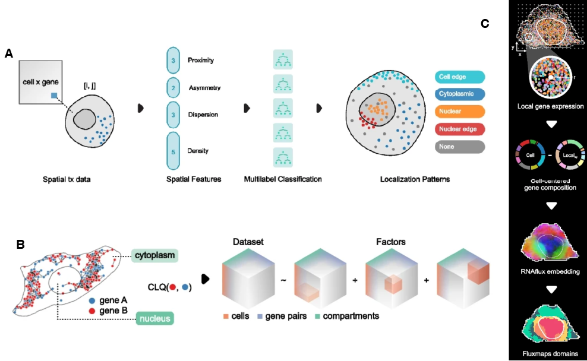
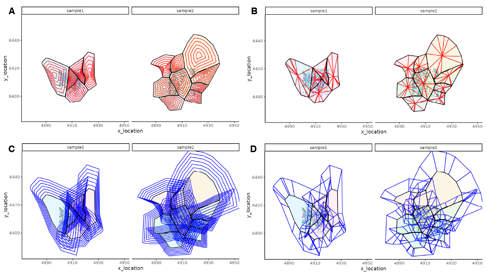
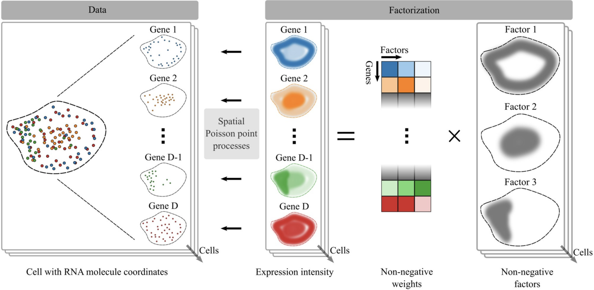
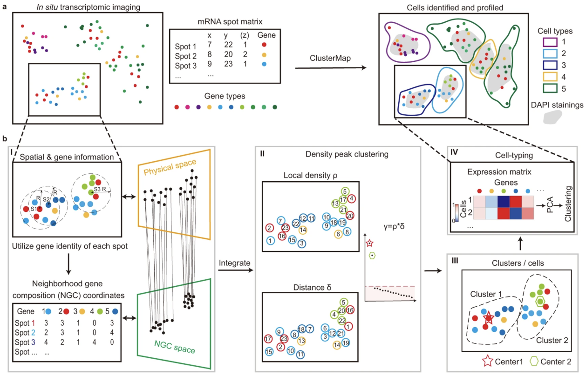
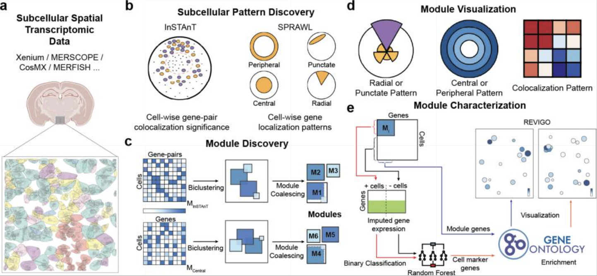

# Sub-cellular analysis {#sec-img-sub-cellular}



## Preamble

### Introduction

Sub-cellular analysis aims to identify intra-cellular compartmentalization of transcripts, e.g., in the nucleus *vs* cytoplasm of the cell. Sub-cellular data can capture real biology, and analysis of sub-cellular could help identify biological mechanisms involved in transcript localisation [@Cassella2022-subcell-analysis]. Variation in intra-cellular localisation of transcripts generates gene expression gradients within the cell that can affect biological processes, such as cell communication and post-transcriptional regulation.

### Data structure

In spatially-resolved transcriptomics (SRT), sub-cellular analysis can be performed with molecule-resolved data generated by imaging-based SRT technologies, such as MERFISH and Xenium, where targeted probes are used to capture specific transcripts and their locations. High-resolution sequencing-based SRT data, such as VisiumHD, have also been employed for sub-cellular analysis [@Novoselsky2025-subcell-visiumhd].

Cell segmentation is required, prior to sub-cellular analysis, to generate cell boundaries within which the transcripts can be compartmentalized and assessed. `r BiocStyle::Biocpkg("MoleculeExperiment")` [@PetersCouto2023-MoleculeExperiment] was built for storing transcript locations and cell boundaries, and is compatible with raw data generated by most existing molecule-resolved SRT technologies. It contains additional functions, such as `countMolecules()`, for conversion of molecule-resolved information to cell-level expression by counting transcripts within a cell boundary.

## Quantifying cell compartments

### Nucleus versus cell

Many molecule-resolved SRT technologies, such as MERFISH, SeqFISH, Stereo-seq, etc., provide nucleus and cell level data, generally using DAPI images to generate nuclear masks. These masks can be used to identify transcripts present in the nucleus *vs* cytoplasm of a cell, and the sub-cellular data can be used to ask a number of research questions. For example, the transport dynamics (from nucleus to cytoplasm) and localisation of transcripts within cells, the impact of sub-cellular localisation of transcripts on cell function, and comparison of sub-cellular location of transcripts between cells from different conditions.

### Bento

[Bento](https://github.com/YeoLab/bento-tools) [@Mah2024-Bento] is a Python-based toolkit for sub-cellular analysis of molecule-resolved SRT data that takes transcript locations and boundaries (cell, nucleus, region of interest) as input and stores them in AnnData format for downstream analyses. Bento includes 3 main approaches for processing molecule-resolved data:

1.  It generates spatial summary statistics for each gene-cell pair and feeds these into **RNAforest** model to predict transcript localisation pattern (cytoplasmic, nuclear, nuclear edge, cell edge, or none) in each cell.

2.  It identifies transcript compartment (nucleus or cytoplasm) from nucleus and cell boundaries, generating a cell x gene x compartment tensor. **RNAcoloc** approach is then applied to use the tensor for assessing co-localisation of gene pairs in each compartment.

3.  It generates **RNAflux** embeddings of local neighborhoods in each cell, which are used for unsupervised segmentation of sub-cellular domains.

```{r fig-bento, echo = FALSE, out.width = "60%", fig.cap= "Bento approaches for sub-cellular analysis include: A, RNAforest; B, RNAcoloc; C, RNAflux."}

```

These approaches supplement other downstream analyses, such as differential expression analysis between compartments or sub-cellular domains or enrichment analysis of these compartments/domains.

### SpatialFeatures

`r BiocStyle::Githubpkg("SydneyBioX/SpatialFeatures")` is a R package that uses MoleculeExperiment to store transcript location and boundaries (cells, nuclei, and/or regions of interest), and perform sub-cellular and extra-cellular analyses. SpatialFeatures run involves 3 main steps:

1.  Generate new sub-cellular (sub-concentric, sub-sector) and extra-cellular (super-concentric, super-sector) boundaries (`loadBoundaries()`).

```{r fig-spFeatures, echo = FALSE, out.width = "60%", fig.cap= "The boundary feature types in SpatialFeature can be sub-cellular (A, sub-concentric; B, sub-sector) or extra-cellular (C, super-concentric; D, super-sector)"}

```

2.  Calculate entropy-based metrics (`EntropyMatrix()`) for each cell across the boundary feature type.

3.  Combine these information into a SingleCellExperiment object (`EntropySingleCellExperiment()`) containing a cell x feature matrix assay for each boundary feature type (sub-concentric, sub-sector, super-concentric, super-sector).

These features can be used to cluster and identify cells with similar sub-cellular and/or extra-cellular expression patterns.

## Factor modelling

### FISHFactor

`r BiocStyle::Githubpkg("bioFAM/FISHFactor")` [@Walter2023-FISHFactor] is another Python-based method for sub-cellular data analysis. It uses spatial Poisson point processes to model location of each transcript within each cell and spatially-aware Gaussian processes to identify sub-cellular localisation patterns.

```{r fig-fishFactor, echo = FALSE, out.width = "60%", fig.cap= "FISHFactor method overview."}

```

This approach focuses on transcript sub-cellular patterns or domains, which can be investigated further to gain biological insights [@Walter2023-FISHFactor].

## Subcellular clustering

### ClusterMap

`r BiocStyle::Githubpkg("wanglab-broad/ClusterMap")` [@He2021-ClusterMap] is a Python-based method capable of segmentation-free spatial clustering of transcripts to multiple scales, thereby identifying sub-cellular domains that might represent sub-cellular structures or cell bodies or cell-level clusters representing cell types and domains. It can also perform cell segmentation and sub-cellular compartmentalization using just transcript locations. Depending on the radius used to measure neighborhood size around a transcript, it can identify clusters at sub-cellular (sub-cellular domains/compartments), cell (cell types), or tissue (domain) level, and perform sub-cellular or cell segmentation.

```{r fig-clustermap, echo = FALSE, out.width = "60%", fig.cap= "Overview (a) and workflow (b) of ClusterMap method."}

```

## Testing for subcellular localisation and co-localisation

### CellSP

`r BiocStyle::Githubpkg("bhavaygg/CellSP")` [@Aggarwal2025-CellSP] is a Python-based workflow for identifying sub-cellular patterns of transcripts that can be further used to identify and characterize gene-cell modules. It provides tools for visualizing the gene-cell modules and examining their functional significance.

```{r fig-cellsp, echo = FALSE, out.width = "60%", fig.cap= "Overview of CellSP applicability to sub-cellular data (a). CellSP identifies sub-cellular patterns (b) for gene-cell module discovery (b). It also provides tools for visualization of gene-cell modules (d)."}

```

CellSP uses AnnData format for single cell and spatial transcriptomics analysis. Internally, CellSP uses other tools, such as `r BiocStyle::Githubpkg("KrishnaswamyLab/MAGIC")` [@vanDijk2018-MAGIC] for denoising, `r BiocStyle::Githubpkg("broadinstitute/Tangram")` [@Biancalani2021-Tangram] for imputation, `r BiocStyle::Githubpkg("bhavaygg/InSTAnT")` [@Kumar2024-Instant] for identifying gene-pair sub-cellular co-localisation patterns, and `r BiocStyle::Githubpkg("salzman-lab/SPRAWL")` [@Bierman2024-SPRAWL] for identifying gene sub-cellular localisation patterns.

CellSP outputs a set of gene-cell modules for each sub-cellular pattern type (peripheral, radial, punctate, central, co-localisation). A gene-cell module represents a set of genes or gene pairs that have the same sub-cellular pattern across the same set of cells. The statistical significance of grouping is estimated using a Bonferroni-based score. In each module, genes and cells are characterized using gene ontology (GO) enrichment tests and cell type composition (if available), respectively.

Some statistical tests for gene(s) localisation/co-localisation that can be performed using CellSP include:

-   Testing per cell - does a cell have significant sub-cellular localisation of a set of genes or gene-pairs?

-   Testing across multiple cells - do cells belonging to a cell type/cluster have significant sub-cellular localisation of a gene or gene pair?

-   Testing across multiple groups/samples - are specific genes differentially localized/co-localized in two cell types/clusters from one sample or a cell type/cluster from two different conditions?

### SpaGNN

[SpaGNN](https://github.com/coskunlab/spaGNN) [@Fang2023-SpaGNN] is another Python-based pipeline for sub-cellular analyses, including: 

-   **Sub-cellular clustering** of transcript locations into sub-cellular patches with high transcript density using Leiden graph clustering. 

-   **Sub-cellular patch analysis**, where transcripts of each gene in each patch are summed to generate a patch x gene counts data. This is used to calculate Pearson's correlation between genes across all patches, to identify gene pairs that often co-localize. The statistical significance of these correlation values can be assessed using a t-test. 

-   **Sub-cellular local neighborhoods** are detected within a patch by identifying 9 nearest neighbors of each transcript in the patch. Further analysis involves summing transcript counts in the local neighborhoods and calculating Pearson's correlation between genes. Through permutation analysis, a proximity score is calculated for each gene pair in the patch.

Depending on availability of cell type data, additional questions can be asked. For example, how similar are the patch correlations between same/different cell types, or how consistent is the sub-cellular co-localisation of a gene pair in same/different cell types?

## Considerations

### 2D *versus* 3D

A majority of the molecule-resolved SRT data are 2D projections of 3D structures, such as cells, organelles, or even processes like RNA transport. A few imaging-based SRT technologies are capable of measuring tissue depth as z-axis, generating 3D coordinates with a sparse z-axis. However, working with 2D *vs* 3D data is not so different, since spatial relations are often captured as neighborhoods defined by Euclidean or other distance measures between locations, irrespective of coordinate dimension. Therefore, many tools are able to use n-dimension coordinates for measuring spatial relationships. For example, ClusterMap can use 3D coordinates by using `z_radius` for z-axis data, if its available, whereas for 2D coordinates it sets `z_radius = 0` [@He2021-ClusterMap].

## References {.unnumbered}


