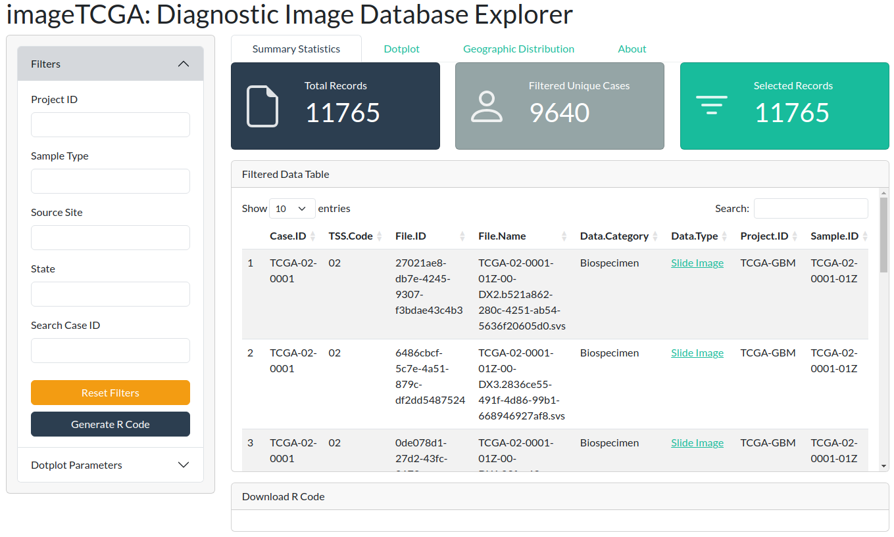
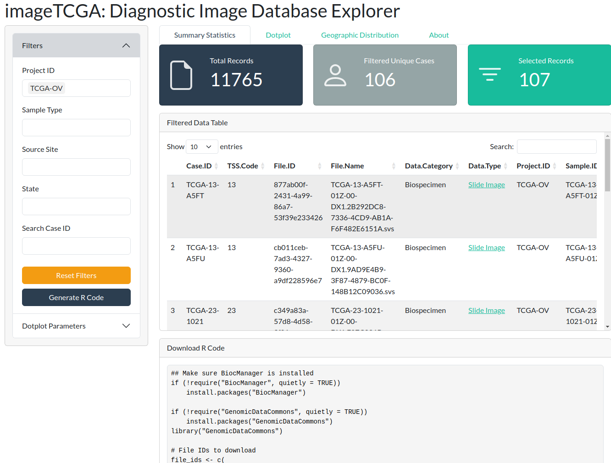
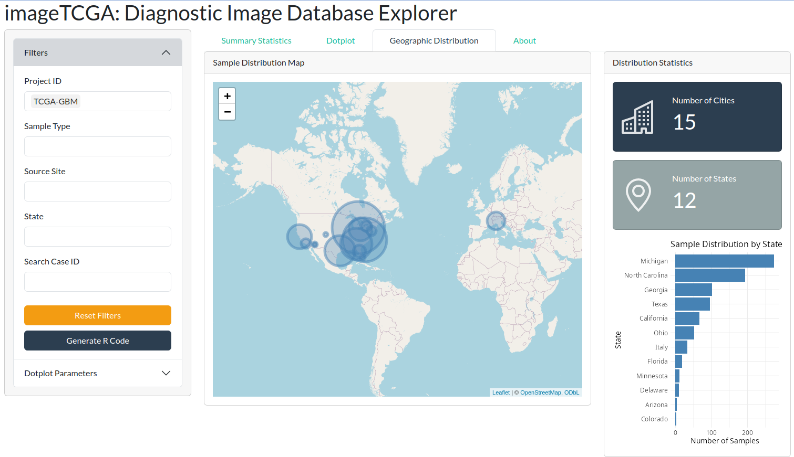

# Image Analysis

## Preamble

### Introduction

Biomedical image analysis encompasses a wide range of imaging modalities, including CT scans, MRI, immunofluorescence, and histological staining such as Hematoxylin and Eosin (H&E). In this chapter, we focus specifically on the analysis of H&E-stained histopathological images, which are routinely used in clinical diagnostics due to their low cost and ability to reveal rich morphological details.

The R and Bioconductor ecosystems offer several tools and workflows to work with digital pathology data. However, a central question remains: what constitutes the most valuable information in these images? Is it the image itself, or the biological and clinical insights that can be computationally extracted from it?

In previous chapters, spatial transcriptomics and its power in linking gene expression to tissue architecture is discussed. Here, we continue along this line by exploring how histopathological images can be leveraged to extract meaningful features—both handcrafted and learned—that serve as input for integrative analyses in cancer research and beyond.

### Dependencies

```{r load-libs, message=FALSE, warning=FALSE, eval=FALSE}
library(imageTCGA)
library(TCIAAPI)
```

### H&E images
Histology is the study of normal tissue structure, whereas pathology focuses on identifying abnormalities in diseased tissues—both commonly rely on Hematoxylin and Eosin (H&E) staining to visualize cellular and tissue morphology. This is why the term histopathology is used to describe the microscopic examination of diseased tissue.

Hematoxylin and eosin (H&E) staining is one of the most widely used and cost-effective techniques in histopathology. It provides essential morphological information by staining cell nuclei (hematoxylin) and cytoplasmic or extracellular components (eosin), allowing for clear visualization of tissue architecture. Due to its low cost, high availability, and compatibility with routine clinical workflows, H&E staining is the standard first step in pathological diagnosis. In recent years, digital pathology has enabled the large-scale acquisition and analysis of H&E-stained whole-slide images (WSIs), fostering the development of computational methods to extract quantitative features and support data-driven research in cancer and other diseases. Recent studies have demonstrated how histopathological images can be used to predict genomic alterations, transcriptional states, or even patient outcomes using machine learning [@madabhushi2020precision], [@schmauch2020deep], [@bergstrom2024deep]. Examples include HE2RNA, which predicts RNA-Seq profiles from images [@schmauch2020deep], and models that infer spatial transcriptomics from histology [@pizurica2024digital].

Digital pathology workflows rely on high-resolution whole-slide images (WSIs) generated by proprietary scanners from different vendors. These WSIs are saved in specific file formats, each corresponding to a particular scanner type. Understanding these formats is essential for designing interoperable and reproducible computational pipelines.

The scanner brands and their respective file formats commonly encountered in digital pathology include:

   *  Aperio: .svs, .tif
   *  DICOM-compatible scanners: .dcm
   *  Hamamatsu: .vms, .vmu, .ndpi
   *  Leica: .scn
   *  MIRAX: .mrxs
   *  Philips: .tiff
   *  Sakura: .svslide
   *  Trestle: .tif
   *  Ventana: .bif, .tif
   *  Zeiss: .czi
   *  Generic tiled TIFF: .tif


Each scanner uses a unique tiling scheme and metadata structure to support rapid visualization and efficient storage. For instance, Aperio's .svs format uses a pyramidal tiling strategy with multiple image resolutions stored within a single file as shown in Fig.. 

Several publicly available repositories, such as The Cancer Genome Atlas (TCGA) and The Cancer Imaging Archive (TCIA), provide free access to large-scale genomic and imaging datasets. In the following sections, we will explore these resources in more detail.

### TCGA Data
[The Cancer Genome Atlas (TCGA)](https://cancer.gov/ccg/research/genome-sequencing/tcga)  includes a collection of 11,765 diagnostic whole-slide images from 9,640 patients across 33 cancer types. \parencite{tomczak2015review} These histopathological images represent only one component of TCGA's broader multi-omics repository. Alongside WSIs, TCGA provides a rich array of molecular and clinical data, including gene expression (RNA-Seq), somatic mutation profiles (whole-exome sequencing), DNA methylation, copy number alterations, protein expression (RPPA), and comprehensive clinical annotations. This multidimensional dataset facilitates integrative analyses that connect tissue morphology with molecular alterations and clinical outcomes.

TCGA includes two main types of histological slides: flash frozen and formalin-fixed paraffin-embedded (FFPE). Flash frozen slides are typically produced intraoperatively in a cryolab to help surgeons assess tumor margin status. While this method ensures close proximity to the tissue used for genomic extraction, it often introduces morphological artifacts such as tissue cracking and holes due to freezing, resulting in a "Swiss cheese" appearance that limits their utility for computational analysis.

Conversely, FFPE slides, considered the gold standard in diagnostic histopathology, are created by chemically fixing tissue in formalin and embedding it in paraffin wax before slicing. These slides preserve fine tissue architecture and provide visually high-quality samples, making them more suitable for algorithmic analysis. However, because of spatial heterogeneity in tumors, FFPE samples may not precisely correspond to the regions used for genomic profiling.

Tissue submitted to TCGA undergoes a structured workflow at the Biospecimen Core Resource (BCR). Two slides—designated top-section (TS) and bottom-section (BS)—are reviewed to evaluate tumor content and necrosis percentage. The central portion of the sample is reserved for RNA and DNA extraction. Additionally, one or more diagnostic FFPE slides are submitted to confirm histopathological diagnosis. These diagnostic slides originate from the same tumor, but the spatial and molecular correspondence to the genomics-extracted tissue is often uncertain. Thus, researchers must consider a trade-off between image quality and genomic adjacency when designing image-based studies using TCGA data. [@cooper2018pancancer] 


### TCIA Data

[The Cancer Imaging Archive (TCIA)](https://www.cancerimagingarchive.net/) is a large-scale open-access repository that provides a comprehensive collection of medical images of cancer, including radiological scans (e.g., CT, MRI, PET) and histopathological images. TCIA is a critical resource for cancer imaging research as it includes richly annotated datasets with accompanying clinical, genomic, and pathological metadata. It supports a wide range of applications, including image-based biomarker discovery, radiogenomics, and multi-modal integration studies. Researchers can access TCIA datasets through its user interface or programmatically via APIs, which facilitate the retrieval and processing of large volumes of image data in a reproducible and automated manner.


## imageTCGA 

`r BiocStyle::Biocpkg("imageTCGA")` is an R package designed to provide an interactive Shiny application for exploring the TCGA Diagnostic Image Database. This
application allows users to filter and visualize metadata, geographic
distribution, and other relevant statistics related to TCGA diagnostic
images.

After installing the package, you can run the Shiny application by
executing the following command in R:

```{r, eval=FALSE}
imageTCGA::imageTCGA()
```

```{r fig-imageTCGA, echo = FALSE, out.width = "95%", fig.cap= "Graphical interface imageTCGA shiny app"}

```

This will open the application in your default web browser, where you
can explore 11,765 diagnostic images from 9,640 patients, filtering them
based on various clinical and pathological parameters.

The shiny application allows filtering by any of the available columns in the
dataset. For instance, you can filter for a specific tumor type, such as
Ovarian Cancer (107 diagnostic images).

```{r fig-imageTCGA_filtering, echo = FALSE, out.width = "95%", fig.cap= "Filtering images in imageTCGA shiny application"}

```


You can generate R code to download the selected images to your local machine by clicking the blue “Generate R Code” button. This utilizes the `r BiocStyle::Biocpkg("GenomicDataCommons")` package.

In the example below, Ovarian Cancer images have been selected:
```{r fig-imageTCGA_r_code, echo = FALSE, out.width = "95%", fig.cap= "Generate R code in imageTCGA"}

```


The shiny application provides an interactive geographic visualization, displaying the origin of diagnostic images at the center, country, and state level.

For example, in the image below, GBM tumors have been selected. Additionally, summary statistics such as the number of cities and states are reported alongside a bar plot of the state distribution.

```{r fig-imageTCGA_geo, echo = FALSE, out.width = "95%", fig.cap= "Geographic distribution of GBM tumor imageTCGA shiny app"}

```

## TCIAAPI

The `r BiocStyle::Githubpkg("billila/TCIAAPI")` package provides an interface to the Cancer Imaging Archive (TCIA) API. The TCIA API allows users to programmatically access the TCIA data. The package provides functions to obtain an access token, download SVS images, and retrieve metadata from the TCIA API.

The TCIA API requires an access token to access the data. The
`tcia_access_token` function retrieves the access token from the TCIA
API. By default, it is configured to obtain a public token. Note that
the token expires after a certain period of time and must be refreshed.

```{r, eval=FALSE}
tcia_access_token() |> httr2::obfuscate()
```

Note that we use `httr2::obfuscate` to hide the token from the output.

The `tcia_svs_info` function retrieves metadata information on SVS
images from the TCIA API. The function requires a `camic_id` which is
obtained from the ‘TCIA Histopathology Custom Dataset Builder.json’
file. The json file can be obtained by navigating to the TCIA website
<https://www.cancerimagingarchive.net/> under ‘Access The Data’, ‘Search
Histopathology Portal’ and clicking on the ‘TCIA Histopathology Custom
Dataset Builder’ link.


```{r, eval=FALSE}
svsinfo <- tcia_svs_info("311781") 
svsinfo |> head(3L)
```
The `tcia_svs_info` function returns a list containing the metadata of
the SVS including the download URL. The download URL can be used to
download the SVS images.

```{r, eval=FALSE}
svsinfo[["field_wsiimage"]][[1L]][["url"]]
```

Note that currently the package does not provide a function to download
the ~150 MB json file programmatically.

The `tcia_svs_download` function downloads SVS images from the TCIA API.
Like `tcia_svs_info`, the function requires a `camic_id` which can be
obtained from the ‘TCIA Histopathology Custom Dataset Builder.json’
file.

```{r, eval=FALSE}
tcia_svs_download("311781")
```

The function downloads the SVS images to the temporary directory by
default. The `destdir` argument can be used to specify a different
directory.

## Appendix

### References {.unnumbered}
