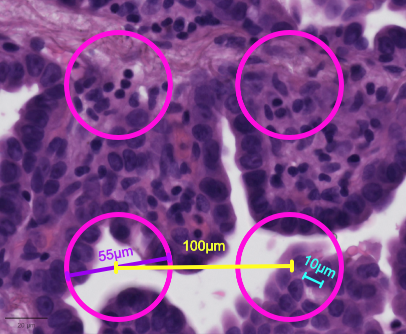

# Deconvolution {#sec-seq-deconvolution}

## Introduction

Sequencing-based ST data can contain zero to multiple cells per spot, which might be fully or only partially covered by cells, depending on the spatial resolution of the platform and the tissue cell density (see also @sec-seq-introduction and the schematic Figure below). This aspect of the data implies that there may be a mixture of cell types in a spot and thus a mixture of transcriptional programs.

```{r, echo = FALSE, out.width = "33%", fig.cap = "Schematic illustrating multiple cells in a 10x Genomics Visium spot (diameter of 55µm; purple line) overlaying the hematoxylin and eosin (H&E) stained image. The center-to-center distance between spots is 100µm (yellow line), and a typical immune cell's diameter is around 10µm (cyan line)."}

```

To help understand these mixtures, at least 20 deconvolution techniques have been proposed for spot-level ST data. Some methods require borrowing insights from a scRNA-seq reference dataset, while others can be reference-free. Based on their underlying algorithms, @li2023comprehensive have grouped methods into five categories:

- **probabilistic-based**: use Bayesian inference, likelihood estimation, or probabilistic modeling to estimate cell type compositions while incorporating uncertainty. Available tools include `r BiocStyle::Biocpkg("spacexr")` (i.e. `RCTD`), `r BiocStyle::Githubpkg("YMa-lab/CARD")`, `r BiocStyle::Biocpkg("SpatialDecon")`, and `r BiocStyle::Githubpkg("JEFworks-Lab/STdeconvolve")` in R, and `r BiocStyle::Githubpkg("SpatialTranscriptomicsResearch/std-poisson")`, `r BiocStyle::Githubpkg("almaan/stereoscope")`, `r BiocStyle::Githubpkg("scverse/scvi-tools")` (i.e. `DestVI`), `r BiocStyle::Githubpkg("DongqingSun96/STRIDE")`, and `r BiocStyle::Githubpkg("BayraktarLab/cell2location")` in Python.
- **non-negative matrix factorization (NMF)-based**: decompose gene expression data into latent components representing different cell types. Available tools include `r BiocStyle::Githubpkg("RubD/Giotto")` (i.e. `SpatialDWLS`) and `r BiocStyle::Biocpkg("SPOTlight")` in R, and [NMFReg](https://github.com/tudaga/NMFreg_tutorial) in Python.
- **graph-based**: use graph neural networks or graph-based optimization to model spatial relationships. Available tools include `r BiocStyle::Githubpkg("leihouyeung/SD2")` in R, and `r BiocStyle::Githubpkg("Su-informatics-lab/DSTG")` and `r BiocStyle::Githubpkg("ma-compbio/SpiceMIx")` in Python.
- **optimal transport (OT)-based**: infer spatial gene expression distributions by mapping scRNA-seq and ST data. Available tools include `r BiocStyle::Githubpkg("zcang/SpaOTsc")` and `r BiocStyle::Githubpkg("rajewsky-lab/novosparc")` in Python.
- **deep learning-based**: align and integrate single-cell and spatial transcriptomics data with neural networks. For example, `r BiocStyle::Githubpkg("broadinstitute/Tangram")` in Python.

Among these, `std-poisson`, `STdeconvolve`, and `SpiceMix` are reference-free methods. Methods that incorporate spatial location information are `CARD`, `DSTG`, `SD2`, `Tangram`, `cell2location`, `DestVI`, `std-poisson`, and `SpiceMix`.

In this section, we will demonstrate deconvolution of cell types per spot, using `RCTD` on Visium and VisiumHD datasets.

## Dependencies {#sec-seq-deconvolution-load-data}

```{r deps, message = FALSE, warning = FALSE}
library(OSTA.data)
library(VisiumIO)
library(SpatialExperiment)
library(ggspavis)
library(spacexr)
library(CARDspa)
library(ggplot2)
library(patchwork)
library(DropletUtils)
library(BiocParallel)
library(scran)
library(scater)
library(pheatmap)
```

In this example of Visium breast cancer data [@Janesick2023], we perform cell type deconvolution without a single-cell (Chromium) reference and compare the concordance with the provided Visium annotation provided by 10x Genomics.

```{r load-vis, message = FALSE}
# retrieve dataset from OSF repository
id <- "Visium_HumanBreast_Janesick"
pa <- OSTA.data_load(id)
dir.create(td <- tempfile())
unzip(pa, exdir = td)

# read into 'SpatialExperiment'
vis <- TENxVisium(
    spacerangerOut = td, 
    processing = "filtered", 
    format = "h5", 
    images = "lowres") |> 
    import()

# retrieve spot annotations & add as metadata
df <- read.csv(file.path(td, "annotation.csv"))
cs <- match(colnames(vis), df$Barcode)
vis$anno <- factor(df$Annotation[cs])

# set gene symbols as feature names
rownames(vis) <- make.unique(rowData(vis)$Symbol)
vis
```

```{r plt-hne, fig.width = 9, fig.height = 3.5}
#| code-fold: true
xy <- spatialCoords(vis) * scaleFactors(vis)
xs <- range(xy[, 1])
ys <- nrow(imgRaster(vis)) - range(xy[, 2])
box <- geom_rect(
    xmin = xs[1], xmax = xs[2], ymin = ys[1], ymax = ys[2], 
    col = "black", fill = NA, linetype = 2, linewidth = 2/3)
plotVisium(vis, spots = FALSE, point_size = 1) + box + 
    plotVisium(vis, point_size = 1, zoom = TRUE) + 
    plot_layout(nrow = 1) & facet_null()
```

Deconvolution is performed after quality control, as detailed in @sec-seq-quality-control, and is usually performed on unnormalized and untransformed (i.e. raw) counts. Here, we quickly check some typically spot-level metrics.

```{r qcvis}
sub <- list(mt = grep("^MT-", rownames(vis)))
vis <- addPerCellQCMetrics(vis, subsets = sub)
```

```{r plt-xy-qc, message = FALSE, fig.width = 6, fig.height = 2.5}
#| code-fold: true
vis$log_sum <- log1p(vis$sum)
plotCoords(vis, annotate = "log_sum") + ggtitle("log library size") + 
    plotCoords(vis, annotate = "subsets_mt_percent") + ggtitle("% mitochondrial") + 
    plot_layout(nrow = 1) & theme(
      legend.key.width = unit(0.5, "lines"), 
      legend.key.height = unit(1, "lines")) & 
    scale_color_gradientn(colors = pals::jet())
```


```{r plt-mito-libsize, fig.width = 6, fig.height = 4}
#| code-fold: true
ggplot(data.frame(colData(vis))) + 
  geom_point(aes(x=sum, y=subsets_mt_percent)) + 
  scale_x_log10() + 
  scale_y_sqrt()
```

A few spots have low library sizes, and can be removed.
```{r vis-filter, message = FALSE}
#| code-fold: true
vis <- vis[,vis$sum > 1000]
```

We first visualize the spot-level cell type annotation provided by 10x Genomics.

```{r visanno, message = FALSE, fig.width = 5.5, fig.height = 3.5}
#| code-fold: true
plotCoords(vis, 
           annotate = "anno", point_size = 1, 
           pal = unname(pals::trubetskoy())) + 
    theme(legend.key.size = unit(0, "lines"))
```

Now, we load the single-cell (Chromium) reference data for the Visium dataset. To streamline the demonstration, we consolidate some of the cell type annotations provided by 10x Genomics (i.e. `Annotation`) into more generalized categories (i.e. `Annogrp`).

```{r deconvis, message = FALSE}
# retrieve dataset from OSF repo
id <- "Chromium_HumanBreast_Janesick"
pa <- OSTA.data_load(id)
dir.create(td <- tempfile())
unzip(pa, exdir = td)

# read into 'SingleCellExperiment'
fs <- list.files(td, full.names = TRUE)
h5 <- grep("h5$", fs, value = TRUE)
sce <- read10xCounts(h5, col.names = TRUE)

# use gene symbols as feature names
rownames(sce) <- make.unique(rowData(sce)$Symbol)

# retrieve cell type labels
csv <- grep("csv$", fs, value = TRUE)
cd <- read.csv(csv, row.names = 1)

# ignore mixtures
lab <- cd$Annotation
lab[grepl("Hyb", lab)] <- NA 

# simplify annotations
pat <- c(
    "B Cell" = "B", "T Cell" = "T", "Mac" = "macro", 
    "Mast" = "mast", "DCs" = "dendritic", 
    "Peri" = "perivas", "End" = "endo", "Str" = "stromal", 
    "Inv" = "tumor", "Myo" = "myoepi")
for (. in names(pat)) 
    lab[grep(., lab)] <- pat[.]
lab <- gsub("\\s", "", lab)

# add as cell metadata
table(cd$Annogrp <- lab)
colData(sce)[names(cd)] <- cd[colnames(sce), ]
```

We only keep the Chromium data with an annotation and are not labeled as "Hybrid", as these correspond to mixed subpopulations.

```{r qcchrom_vis}
sce <- sce[, !is.na(sce$Annogrp)]
dim(sce)
```

## RCTD

Next, we perform deconvolution with `r BiocStyle::Biocpkg("spacexr")` (also known as RCTD)[@Cable2022-RCTD].
[Note that RCTD can also be adapted to Visium HD data with `rctd_mode = "doublet"`, as demonstrated by [@Oliveira2024] and @sec-seq-workflow-visium-hd.]{.aside}
By default, `runRctd()`'s `rctd_mode = "doublet"` specifies at most two subpopulations coexist in a data unit (i.e. within a spot); here, we set `rctd_mode = "full"` in order to allow for an arbitrary number of subpopulations to be fit instead.

```{r dec, message = FALSE, warning = FALSE}
rctd_data <- createRctd(vis, sce, cell_type_col = "Annogrp")
(res <- runRctd(rctd_data, max_cores = 4, rctd_mode = "full"))
```

Weights inferred by `RCTD` should be normalized such that proportions of cell types sum to 1 for each spot:

```{r dec-res}
# scale weights such that they sum to 1
ws <- assay(res)
ws <- sweep(ws, 2, colSums(ws), `/`)

ws_rctd <- data.frame(t(as.matrix(ws)))
ws_rctd[1:5, 1:5] |> round(2)

# add proportion estimates to colData
colData(vis)[names(ws_rctd)] <- ws_rctd[colnames(vis), ]
```


## CARD

Another method that can be used is `CARD`. First, we rename the columns of spatial coordinates for `CARD`.

<!-- First, we realized delayed count matrices and rename spatial coordinate columns to make the input data compatible with CARD [Note: RCTD handles the conversion internally with spacexr::check_counts()]{.aside} -->

```{r}
# realize the delayed matrices, as CARD do not support delayed matrix handling yet
counts(sce) <- as(counts(sce), "sparseMatrix")
counts(vis) <- as(counts(vis), "sparseMatrix")
colnames(spatialCoords(vis)) <- c("x", "y")
```

Next, we perform the `CARD` deconvolution. Here, we demonstrate `CARD`'s interoperability with `SingleCellExperiment` and `SpatialExperiment`. [Note: `CARD` can also take a reference matrix, a reference cell type annotation column, a spatial count matrix, and a spatial coordinates data frame as separate items in `sc_count`, `sc_meta`, `spatial_count`, and `spatial_location`, respectively. However, we encourage simplifying the process by using existing Bioconductor classes.]{.aside} The deconvolution result matrix is already normalized such that the sum of cell type proportions for each spot is equal to 1. 

```{r card-dec, message = FALSE, warning = FALSE}
set.seed(2025)
CARD_obj <- CARD_deconvolution(
    spe = vis,
    sce = sce,
    sc_count = NULL,
    sc_meta = NULL,
    spatial_count = NULL,
    spatial_location = NULL,
    ct_varname = "Annogrp",
    ct_select = NULL,       # decon with all sce$Annogrp cell types
    sample_varname = NULL,  # use all sce as one ref sample 
    mincountgene = 100,
    mincountspot = 5
)
ws_card <- CARD_obj$Proportion_CARD
# order cell type names alphabetically, as for RCTD
ws_card <- data.frame(ws_card[, colnames(ws_rctd)])

ws_card[1:5, 1:5] |> round(2)
```


## Visualization

First, we define a couple accessory functions.

```{r pltxy}
#| code-fold: true
.plt_xy <- \(ws, vis, col, point_size) {
    xy <- spatialCoords(vis)[rownames(ws), ]
    colnames(xy) <- c("x", "y")
    df <- cbind(ws, xy)
    ggplot(df, aes(x, y, col=.data[[col]])) + 
        coord_equal() + theme_void() + 
        geom_point(size = point_size)
}

.plt_decon <- \(ws, vis){
    lapply(names(ws), \(.) 
      .plt_xy(ws, vis, col = ., point_size = 0.3)) |> 
      wrap_plots(nrow = 3) & theme(
      legend.key.width = unit(0.5, "lines"),
      legend.key.height = unit(1, "lines")) &
      scale_color_gradientn(colors = pals::jet())
}
```

We can visualize deconvolution weights in x-y space, i.e. coloring by the proportion of a given cell type estimated to fall within a given spot:

```{r plt-dec-xy-rctd, message = FALSE, fig.width = 7, fig.height = 5}
#| code-fold: true
.plt_decon(ws = ws_rctd, vis)
```

```{r plt-dec-xy-card, message = FALSE, fig.width = 7, fig.height = 5}
#| code-fold: true
.plt_decon(ws = ws_card, vis)
```
            
The deconvolution results can also be viewed as a heatmap, where rows = cells and columns = clusters:

```{r heatmap, fig.width = 3.5, fig.height = 3}
#| layout-ncol: 2
#| code-fold: true
plot_heat_ws <- function(ws, string){
    p <- pheatmap(ws, show_rownames = FALSE, show_colnames = TRUE, main=string,
                  cellwidth = 12, treeheight_row = 5, treeheight_col = 5)
    return(p)
}
plot_heat_ws(ws_rctd, string="RCTD") 
plot_heat_ws(ws_card, string="CARD")
```

In both methods, we see that more than half of the spots are estimated to have a stromal proportion of more than 50%. Few spots have an intense and distinct signal for cancerous subpopulations, DCIS1 and DCIS2. For the following analysis, we focus on `RCTD` as an example.

For comparison with spot annotations provided by 10x Genomics, we include majority voted cell type from deconvolution by `RCTD`.
Note that, because stromal cells show broad signals across the entire tissue, to better investigate immune cell signals, we remove stromal from the majority vote calculation for an alternative label: `RCTD_no_stroma`.

```{r dec-clu}
ws <- ws_rctd
# derive majority vote label
ids <- names(ws)[apply(ws, 1, which.max)]
names(ids) <- rownames(ws)
vis$RCTD <- factor(ids[colnames(vis)])

# derive majority vote excluding stromal cells
ws_no_stroma <- ws[, colnames(ws) != "stromal"]
ids_no_stroma <- names(ws_no_stroma)[apply(ws_no_stroma, 1, which.max)]
names(ids_no_stroma) <- rownames(ws)
vis$RCTD_no_stroma <- factor(ids_no_stroma[colnames(vis)])
```

We can visualize these three annotations spatially:

```{r plt-clu-xy, message = FALSE, fig.width = 9, fig.height = 2.5}
#| code-fold: true
lapply(c("anno", "RCTD", "RCTD_no_stroma"), 
       \(.) plotCoords(vis, annotate=.)) |>
    wrap_plots(nrow = 1) &
    theme(legend.key.size = unit(0, "lines")) &
    scale_color_manual(values = unname(pals::trubetskoy()))
```

Note the strong stromal signals and macrophages being the second most common cell type for stromal cells.
To help characterize subpopulations from deconvolution, we can view their distribution against the provided annotation:

```{r plt-clu-fq, fig.width = 7, fig.height = 2.5}
#| code-fold: true
cd <- data.frame(colData(vis))
df <- as.data.frame(with(cd, table(RCTD, anno)))
fd <- as.data.frame(with(cd, table(RCTD_no_stroma, anno)))
ggplot(df, aes(Freq, RCTD, fill = anno)) + ggtitle("RCTD") +
    ggplot(fd, aes(Freq, RCTD_no_stroma, fill = anno)) + ggtitle("RCTD_no_stroma") +
    plot_layout(nrow = 1, guides = "collect") &
    labs(x = "Proportion", y = NULL) &
    coord_cartesian(expand = FALSE) &
    geom_col(width = 1, col = "white", position = "fill") &
    scale_fill_manual(values = unname(pals::trubetskoy())) &
    theme_minimal() & theme(aspect.ratio = 1,
                            legend.key.size = unit(2/3, "lines"),
                            plot.title = element_text(hjust=0.5))
```

Next, we can investigate the agreement between the provided annotation against the two deconvolution majority vote labels.

```{r dec-clu-nostroma, fig.width = 4, fig.height = 3}
#| layout-ncol: 2
#| code-fold: true
hm <- \(mat, string) pheatmap(
    mat, show_rownames = TRUE, show_colnames = TRUE, main=string,
    cellwidth = 10, cellheight = 10, treeheight_row = 5, treeheight_col = 5)
hm(prop.table(table(vis$anno, vis$RCTD), 2), string="RCTD")
hm(prop.table(table(vis$anno, vis$RCTD_no_stroma), 2), string="RCTD_no_stroma")
```

Overall, we observe agreement between the provided spot labels and the `RCTD` deconvolution derived annotations.
Before cleaning up stromal, some immune cell types, such as dendritic and mast, never had a chance to have the highest cell type proportion. 
On the left panel, among among all the spots annotated by `RCTD` as T cells, nearly all of them are from the "immune" type in the provided annotation. Strong agreements are also observed for spots with cell type of "DCIS1", "DCIS2", and "Invasive tumor".

::: {.callout-note title="PC regression" collapse="true"}
Next, we prepare the principal components (PCs) needed to perform PC regression:

```{r pca}
vis <- logNormCounts(vis)
# Feature selection 
dec <- modelGeneVar(vis)
hvg <- getTopHVGs(dec, prop = 0.1)

# Dimension reduction 
set.seed(1234)
vis <- runPCA(vis, ncomponents = 20, subset_row = hvg)
```

We fit the deconvolution result of each cell type against the first 10 PCs to obtain 10 regressions.

```{r pcr}
idx <- rownames(ws)
ids <- colnames(ws)
pcs <- reducedDim(vis, "PCA")
pcs <- pcs[idx, seq_len(10)]
pcr <- lapply(ids, \(id) {
    fit <- summary(lm(pcs ~ ws[[id]]))
    r2 <- sapply(fit, \(.) .$adj.r.squared)
    data.frame(id, pc = seq_along(r2), r2)
}) |> do.call(what = rbind)
```

Here we plot the coefficient of determination of the first 10 PCs for each cell type.

```{r pcr-plot, warning = FALSE, fig.width = 6, fig.height = 3}
#| code-fold: true
pcr$id <- factor(pcr$id, ids)
pal <- pals::trubetskoy()
ggplot(pcr, aes(pc, r2, col=id)) +
    geom_line(show.legend = FALSE) + geom_point() +
    scale_color_manual("predictor", values = unname(pal)) +
    scale_x_continuous(breaks = c(1, seq(5, 20, 5))) +
    scale_y_continuous(limits = c(0, 1), breaks = seq(0, 1, 0.2)) +
    labs(x = "principal component", y = "coeff. of determination") +
    guides(col = guide_legend(override.aes = list(size=2))) +
    coord_cartesian(xlim = c(1, 10)) +
    theme_minimal() + theme(
      panel.grid.minor = element_blank(),
      legend.key.size = unit(0, "lines"))
```

Let's inspect the key drivers of (expression) variability in terms of PCs. Considering deconvolution results from above, we can see that:

-   PC1 distinguishes stromal, tumor, macrophage from the rest of the tissue;
-   PC2 clearly separates myoepi;
-   PC3 captures T cells region;
-   PC5 separates endothelial.


```{r plt-pcs-xy, message = FALSE, fig.width = 5.5, fig.height = 4}
#| code-fold: true
pcs <- reducedDim(vis, "PCA")
pcs <- pcs[rownames(ws), seq_len(10)]
lapply(c("myoepi", "T", "endo", colnames(pcs)[c(2, 3, 5)]), 
       \(.) .plt_xy(cbind(ws, pcs), vis, col = ., point_size = 0.3) +
         scale_color_gradientn(., colors = pals::jet())) |>
    wrap_plots(nrow = 2) & theme(
      plot.title = element_blank(),
      legend.key.width = unit(0.5, "lines"),
      legend.key.height = unit(1, "lines"))
```

Note that the direction of each PC is irrelevant from how much variation it explains.
:::

In conclusion, deconvolution-based cell type proportion estimates are able to recapitulate PCs and, in turn, expression variability.
[Apart from being a tool for spot deconvolution, `RCTD` can be used as a label transferring tool to annotate imaging-based ST data, such as for Xenium and MERSCOPE.
In such scenarios, the default `doublet_mode = "doublet"` should be used and a certainty score would be returned to indicate doublets with two predicted cell types.]{.aside}


## Appendix

### Benchmarks {.unnumbered}

Benchmarking studies of deconvolution methods often require generating synthetic spots to establish a ground truth for cell type proportions. This process involves either simulating artificial tissue patterns or aggregating counts from scRNA-seq or imaging-based spatial transcriptomics data into spots. However, it is equally important to evaluate how these methods perform in tissues with highly spatially-heterogeneous cell type compositions, such as real cancer samples. Below are three comprehensive benchmarking studies, two of which that incorporate both artificial and real datasets.

- @chananchida2023spotless developed a pipeline to benchmark 11 deconvolution methods, including `RCTD`, across 63 synthetic, 3 binned, and 2 real datasets. `RCTD` and `cell2location` were the most recommended methods. Figure 2 gives an overview of the benchmarking results.

- @li2023comprehensive benchmarked 18 deconvolution methods, including `RCTD`, across 50 simulated and real datasets. Among these methods, `CARD`, `cell2location`, and `Tangram` are highly recommended. Figure 1 summarizes the method performance, and Figure 4 gives a flowchart of how to decide on which method to use.

- @GaspardBoulinc2025deconv review and compare available cell-type deconvolution methods, and provide a continuously updated web-based summary table.


### References {.unnumbered}
