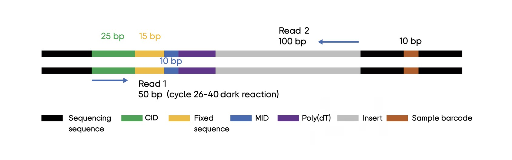
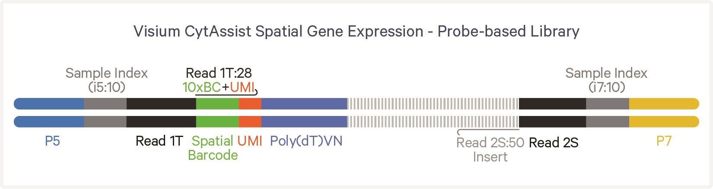
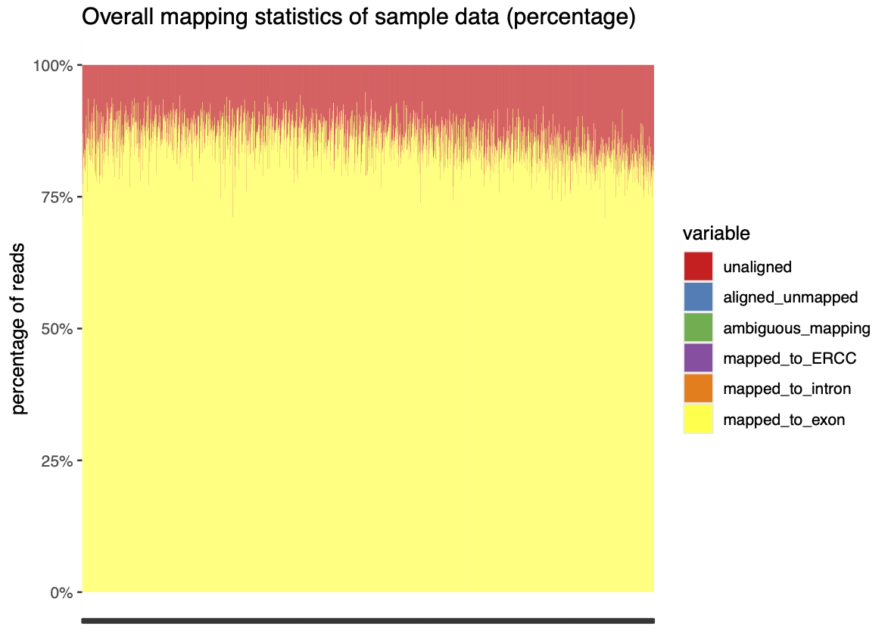
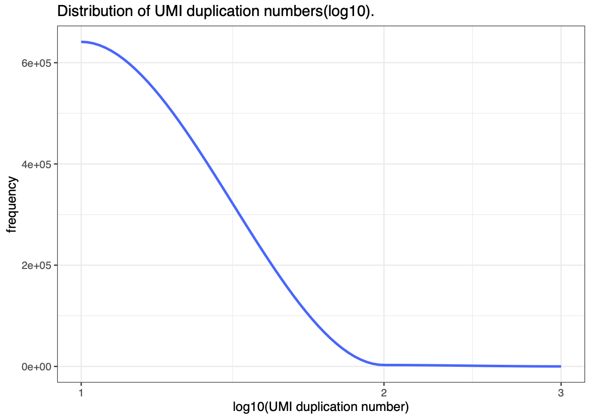
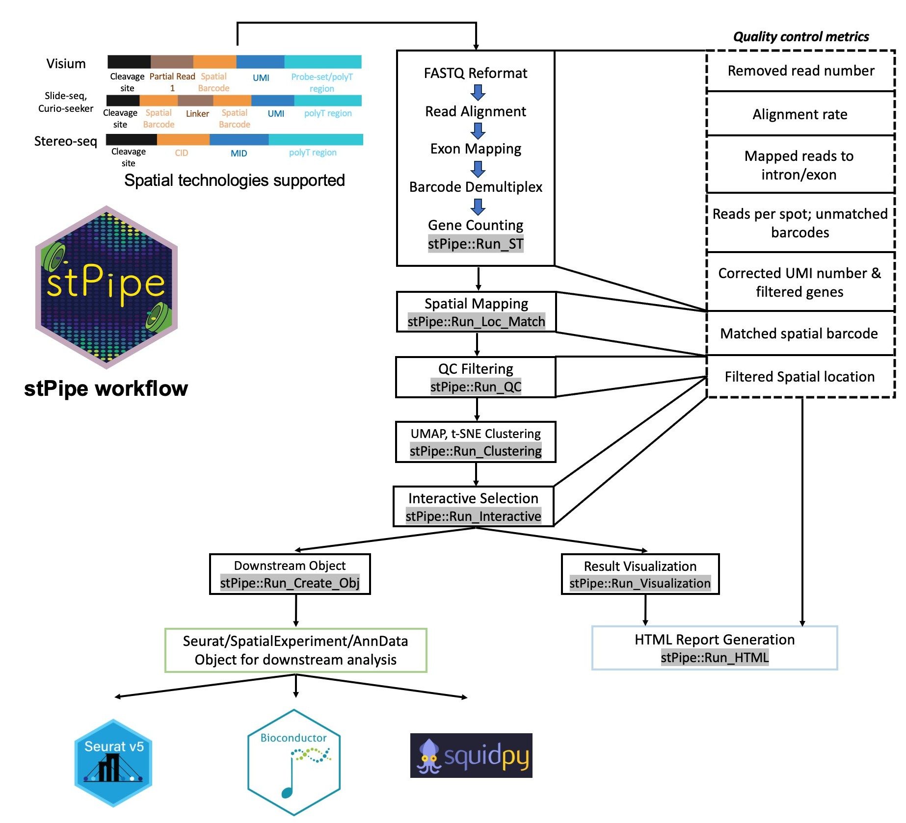

# Preprocessing {-}

## Background
Sequencing-based Spatial Transcriptomics (sST) platforms employ next-generation sequencing (NGS) to quantify gene expression across spatial locations on a tissue based on spatial barcodes. The spatial location information is encoded during platform manufacture and sample preparation, and associated with transcripts measured during sequencing. This association is present within the structure of the reads sequenced by an NGS platform.

To perform spatial data analysis several preprocessing steps are needed to convert raw sequencing data into a useful format, often a count matrix, from which we can analyse gene expression across a tissue of interest. These steps differ platform to platform but all start from a series of 'reads' and end with one of the several spatial data formats used with downstream analysis tools like `Squidpy`, `Seurat`, or Bioconductor workflows using `SpatialExperiment` objects.

## Introduction to Reads and Sequencing
When we talk about 'reads' in transcriptomics we're referring to a sequence of nucleotides (bases) which represent a cDNA fragment which is reverse transcribed from an RNA molecule. The abundance of these transcripts is corollary to gene expression which is what we're trying to measure in transcriptomics analysis. The benefit to spatial transcriptomics data is the ability to associate reads with locations on the tissue where the RNA molecule, and thus the expression of the corresponding gene, originated. The process of generating reads generally involves the following steps:
1. RNA Extraction
2. Reverse Transcription
3. cDNA Fragmentation
4. Adapter Ligation
5. PCR Amplification

Because of the PCR Amplification step, and the imperfect nature of RNA Extraction we can only consider read abundance as a relative measure of gene expression, and it should never be treated as an absolute measure. Additionally, this means that steps need to be taken to normalise the data before analyses such as Differential Expression (DE) analysis can be performed. However, well before the point in analysis where we might perform Normalisation, reads first need to be pre-processed through a number of methods to construct a count matrix or equivalent data structure, which we would normally use in downstream analysis. The rest of this chapter aims to address these pre-processing steps and provide some examples to help when pre-processing in your own analysis.

### Read Structure
For the majority of sequencing based spatial technology platforms reads are recorded as 'paired end' where both ends of the DNA fragment are sequenced into different files, often `.fastq` files. One of these files (often read 1) contains barcode sequences, and depending on whether reads have been trimmed first, may also include linking or other structural sequences. The other file will contain the sequence containing the transcript (or probe) which we intend to align to a reference genome (or probe-set) to determine the gene expressed.

An example read structure from the BGI STOmics Stereo-seq is given below[^1]:

{#fig-read_structure}

Here we see that Read 1 constitutes the first 50bp from the left end of the sequence and Read 2 the last 100bp starting from the right end of the sequence.

Read 1 contains 25bp of the Coordinate ID (CID), a fixed linking sequence 15bp long, and a 10bp Molecule ID (MID).

Read 2 only contains a fragment of the transcript captured (100bp long).

Another example, this time from the 10X Visium CytAssist kit is provided to demonstrate the structure of a probe based library:



Each read in a `.fastq` file also has an associated read header and quality score. An example (also from the STOmics Stereo-seq user manual)[^2] is provided for demonstration:

{#fig-fastq_format}

The first line of both reads is the read 'header' or 'name' and is used to uniquely identify each read and potentially details such as the sequencer lane the read is from. The header is also where tools can insert their own additional metadata for the read as 'comments'. The second line contains the bases of the sequenced transcript as described earlier. Line three is a spacer line and often just contains a single '+' character although occasionally the read identifier and comments from the header are duplicated here. Line four contains the read quality scores for each base of the sequence. The quality scale differs depending on the sequencer version and whether Q4 or Q40 files are used. Q-scores are a logarithmic measure of confidence in base calling given by a p-value. The exact calculation of this p-value and the threshold at which reads are rejected differs platform to platform so it's always worth checking the tools you're using if these statistics are important to your analysis.

## From Reads to Counts
The process of converting a series of reads into a count matrix generally follows a consistent overall structure. This can be broken down into a series of steps which all workflows in some form perform:
1. Barcode Deconvolution
2. Read Alignment
3. Filtering and QC
4. Counting and Binning

After these steps further QC and processing is performed at the count matrix level including:
1. Spot level Filtering and Quality Control (QC)
2. Normalisation
3. Feature Selection

::: {.callout-note}
See the chapters on Quality Control (#seq-quality-control), and Processing (#seq-processing)
:::

### Barcode Deconvolution
Although reads contain most of the information we need to construct a count matrix, a ‘mapping’ file to interpret the Coordinate IDs (CIDs) in Read 1 is often needed to resolve the spatial localisation of the recorded gene expression. For some sST platforms the mapping from barcodes to locations is fixed, such as for 10X Visium, and the mapping file will be fixed for the protocol version while for others the mapping is random and the vendor will have provided a file for this mapping specific to your chips. When the mapping file is fixed most tools, such as Space Ranger, will be able to fetch the mapping file automatically given the chip ID, however when the mapping file is chip specific this will need to be handled by the user.

The process of mapping reads based on their CIDs to spatial locations is known as barcode deconvolution and is often the first step in sST data preprocessing. As this is also the step that differs most platform to platform and across protocol/data versions, it is also the most important step to understand at a lower level than the rest of the steps.

<!--
To this end a worked hypothetical example of how to perform this preprocessing step is provided below:

::: {.callout-tip collapse="false"}
## Example Barcode Deconvolution Methodology

To begin with we describe the inputs and outputs of this preprocessing step, and what we hope to accomplish throughout.

In:

* Read 1 FASTQ (barcode information)
* Read 2 FASTQ (sequence information)
* Barcode Mapping File (in matrix or tabular form)
* Sequence configuration information

Out:

* Formatted FASTQ (or BAM) including barcode information
* Mapping statistics (optional but recommended)

The formatted FASTQ (or BAM) should now contain the x,y coordinates we deconvolved from the CIDs, and the UMI sequence (or an encoding thereof) from Read 1 in the header of each read, followed by the transcript sequence (or probe insert), and the sequence quality scores from Read 2. At this stage you should also report the mapping quality and statistics from the mapping process (such as % of successfully mapped reads, reads discarded due to low quality, etc...)

There are several initialisation steps, but the bulk of the deconvolution time will be spent mapping the CIDs to coordinates and returning the results to the new output. As such C++ is chosen for the code examples for its high performance and throughput, although the process will look similar regardless of the language chosen.

::: {.callout-note}
Note that because this step of preprocessing will often take a significant amount of time to complete the code blocks provided are for example only and will not be executable.
:::

First we open all the FASTQ files we'll need to interface with (in this example using kseq from the C++ htslib library), and build a hashmap for barcode deconvolution from the mapping file.

```{r, eval=FALSE, echo=FALSE}
1+1 # needed to force Quarto to use knitr
```

### Preamble
```{cpp, title}
#| code-fold: show
#| code-line-numbers: true
// needed for opening fastq files:
#include <zlib.h>
#include <htslib/kseq.h>

// standard lib includes:
#include <iostream>
#include <string>
#include <map>
#include <set>
#include <utility>
#include <iterator>
#include <bitset>
#include <stdlib.h>
#include <vector>
#include <unordered_map>

// setup namespaces and initialise KSEQ:
using std::cout;
using std::endl;
#ifndef H5_NO_NAMESPACE
    using namespace H5;
#endif
    
KSEQ_INIT(gzFile, gzread);
    
// this will be needed to store the x,y coordinates in the map
#define COORDPAIRTOINT(a, b) (a << 16) + b;

```

### File Initialisation and Barcode Map Building
```{cpp}
#| code-line-numbers: true
// This function is used to convert the barcode in the mapping file to an integer
// we can store in the map. 
// Some platforms will already store the barcodes as integers 
// in which case this function isn't necessary 
// but we will need to convert the CID sequences in read 1 
// to the corresponding integer representation used in the map
unsigned long int BarcodeToInt(std::string sequence) {
  ... // this will depend on the chosen integer representation of the barcode sequence
  return int_barcode
}

// function for performing deconvolution following I/O structure above:
void RunDemultiplex(const char* read_1_fq_path, const char* read_2_fq_path, const char* mapping_path, const char* output_fq_path, int n_reads, int cid_start, int cid_len, int umi_start, int umi_len) {    
  // open all files (gzip needed if files stored as .fq.gz which most should be)
  gzFile _fp = gzopen(read_1_fq_path, "r");
  gzFile _fp_r2 = gzopen(read_2_fq_path, "r");
  gzFile fp_write = gzopen(output_fq_path, "w");
  kseq_t* _seq = kseq_init(_fp);
  kseq_t* _seq_r2 = kseq_init(_fp_r2);
  
  // open the mapping file (this will differ platform to platform)
  std::unique_ptr<MappingFileType> mapping_file = std::make_unique<MappingFileType>(mapping_path, {mapping_file_args});
  
  // the barcode space of the mapping file comes either from the dimensions of the mapping file matrix, or the length of the file in the case of tabular data
  int n_barcodes = mapping_file->getSize(); // example method
  
  // store mapping file contents in a buffer
  // allows for immediate map resizing to save on reallocations
  // also makes iterating over the file easier
  std::vector<unsigned long> buf(n_barcodes);
  unsigned long *buf_ptr = buf.data();
  
  // next read the mapping file into the buffer
  mapping_file->data.read(buf_ptr, {read_args});
  
  
  // build hashmap
  std::unordered_map<unsigned long, unsigned int> barcode_map;
  barcode_map.reserve(n_barcodes);
  
  for (auto b : buf) {
    unsigned int value = COORDPAIRTOINT(b.x, b.y);
    if (!barcode_map.try_emplace(BarcodeToInt(b.barcode), value).second) {
      barcode_map[b] = 0; // erase value in the case of two or more barcodes with the same coordinates (how this is handled is up to the user, this is merely one option)
  }
  ...
```

After the mapping file has been constructed we need to iterate over reads from both FASTQ files and extract the CIDs and UMIs from read 1 and convert the CID sequence into the integer representation used for the keys in the map. This is then inserted into the reformatted header we will write out to the output FASTQ.

### Deconvolution
```{cpp}
#| code-line-numbers: true
void RunDemultiplex(const char* read_1_fq_path, const char* read_2_fq_path, const char* mapping_path, const char* output_fq_path, int n_reads, int cid_start, int cid_len, int umi_start, int umi_len){
  ...
  int l = 0; // read 1 status variable (0 = OKAY, -1 = ERROR)
  int l_r2 = 0; // read 2 status variable
  for (int i = 0; (i < n_reads && l >= 0); i++) {
    l = kseq_read(_seq);}
    l_r2 = kseq_read(_seq_r2);
    // extract information from read 1
    std::string seq_str = _seq->seq.s;
    std::string cid = seq_str.substr(cid_start, cid_len);
    std::string umi = seq_str.substr(umi_start, umi_len);

    // convert the CID to the integer representation used in map
    int int_cid = BarcodeToInt(cid);

    // if CID found:
    if (barcode_map.find(int_cid) != barcode_map.end()) {
      int cid_value = barcode_map.find(int_cid)->second;
      std::string x = std::to_string((cid_value & 0xFFFF0000) >> 16)); // extract x coordinate from map value
      std::string y = std::to_string((cid_value & 0x0000FFFF)); // extract y coordinate from map value
      // setup output read structure including read 2 contents
      std::string read_id = "@" + cid + "_" + umi + "#" + (_seq_r2->name.s) + ":x" + x + ":y" + y;
      std::string out_buf = read_id + "\n" + (_seq_r2->seq.s) + "\n+\n" + (_seq_r2->qual.s) + "\n";
      // write to output FASTQ
      gzwrite(fp_write, out_buf.c_str(), out_buf.size());
    } else { // if CID not found:
      continue; // report misses here or perform error correction
    }
  }
  ...
```

### Closing Files and Saving Outputs
```{cpp}
#| code-line-numbers: true
#| code-fold: show
void RunDemultiplex(const char* read_1_fq_path, const char* read_2_fq_path, const char* mapping_path, const char* output_fq_path, int n_reads, int cid_start, int cid_len, int umi_start, int umi_len){
  ...
  kseq_destroy(_seq);
  kseq_destroy(_seq_r2);
  gzclose(_fp);
  gzclose(_fp_r2);
  gzclose(fp_write);
}
```

This is just an example of how this process can be performed however and is provided for demonstration purposes only. Each platform will require its own specific approach but we hope the above serves as useful example to build upon and adapt to your specific needs. Many parts are left out of the above for brevity such as error correction in barcode mapping, mapping statistics recording and reporting, and the specific details of the input and output structure are left to the user.

::: {.callout-note}
The code above was taken largely from the Stereo-seq barcode demultiplexing submodule of `stPipe` and will not work as provided. It is intended only to be a demonstration of how to write your own barcode demultiplexing code.
:::

:::
-->

### Read Alignment
The sequences which correspond to transcripts are not particularly useful as is, for useful data analysis to be performed the transcripts need to be mapped back to the genes which expression they resulted from. This is done by aligning the sequences to a reference genome annotated with the locations of genes.

Alignment is performed by a software aligner such as `STAR`[^3], or `Rsubread`[^4]. SpaceRanger and SAW are vendor pipelines for Visium and Stereo-seq respectively and both make use of `STAR` for alignment.

### Filtering and QC
At the read level, filtering and QC is performed based on information from all of the previous preprocessing steps: reads with low Quality Scores are filtered out, reads with barcodes that didn't map to known CIDs or MID/UMIs are filtered out, and finally reads that didn't align to the reference genome, aligned to multiple regions ambiguously, or aligned to intronic regions are all likely to be filtered out depending slightly on the tool/pipeline and parameters thereof.

Once filtering has been performed, Quality Control metrics can be used to fine-tune additional filtering performed on the data either at the read level, or later at the spot level. Some commonly used metrics and plots are as follow:
* Quality Score distribution/density plots
: -> Can help identify any clear patterning in Q-scores that might indicate contaminants or rna degradation.
* Read mapping statistics
: -> Useful to check that the aligner is configured correctly as well as the quality of the mapping
* UMI Duplication distribution.
: -> Can help to check that PCR amplification was successful and to empirically evaluate sequencing depth.

(An example of the last two plots from stPipe's HTML report is given in Fig 3)

::: {#fig-stpipe_qc layout-ncol=2}

{#fig-read_mapping}

{#fig-umi_duplication}

Two QC plots from stPipe's automatically generated HTML report. The first shows Read Mapping Statistics; The second shows the UMI Duplication distribution
:::

### Counting and Binning
Once all read level steps have been performed and reads have been associated with spatial locations using the deconvolved CIDs a matrix of gene by spot (location) can be constructed and each read counted based on CID and the gene annotated at the aligned region.

Most platforms at this stage will 'bin' the spots to a lower resolution by combining the counts of an n by n square of spots (often 20, 50, 100, or 200 depending on the base spot size) to reduce sparsity and make the data easier to analyse.

Binning can also be done to cellular resolution if the platform in question has spots smaller than the cell types composing the tissue. For cell binning the high resolution microscopy images and the DAPI stain (if available) are used to find cell boundaries and spots within those boundaries are combined into a single object like with square binning.

## Preprocessing Tools

### Vendor Tools

* Space Ranger[^5]
: Space Ranger is a popular bioinformatics pipelines developed by 10X Genomics for their Visium platform. Newer versions of Space Ranger also support Visium HD data processing. The Space Ranger can be divided into two main parts: (1) read processing and (2) image processing. The former involves the following steps:
1. Read trimming
2. Assay alignment
3. Barcode correction
4. Profile filtering
5. UMI counting
6. Spot binning 

* SAW[^6]
: The Stereo-seq Analysis Workflow (SAW) is a preprocessing pipeline designed by BGI to handle the complexities of spatial transcriptomics data from the Stereo-seq technology. SAW requires a reference genome, CID mapping file(s) (often hdf5 format), FASTQ files, and optionally tissue images for cell segmentation. The specific workflow of SAW includes the following steps:
1. Data reformatting
2. CID Mapping error counting
3. Genome Alignment
4. Clustering and Feature Selection
5. MID Correction
6. Spatial Visualization and Tissue Region Extraction

* Curio Seeker Bioinformatic Pipeline[^7]
: The Curio Seeker bioinformatics pipeline developed by Curio Bioscience processes sST data from the Curio Seeker spatial mapping kit, it is written in Nextflow, and both Singularity and Docker can execute it. The pipeline requires paired end FASTQ files, bead barcode locations, and a reference genome. The Curio Seeker pipeline involves barcode extraction and mapping, read alignment with `STAR`, and UMI deduplication with `UMItools`. Curio Seeker follows a similar workflow pattern to the other tools mentioned, but with some notable differences due to the bead distribution used for spatial barcoding:
1. Bead Barcode extraction and read trimming
2. Read Filtering
3. Barcode matching
4. Read alignment
5. Feature extraction
6. UMI deduplication

### stPipe: A Platform Agnostic R-based Solution
StPipe[^8] is a sST data preprocessing tool designed to be platform agnostic, and to unify the preprocessing of sST data from a wide variety of spatial technology solutions such as 10x Visium, BGI Stereo-seq, and Curio Slide-seq.

The stPipe workflow (Fig 4) begins with the function Run_ST which streamlines multiple steps into one cohesive process, including FASTQ
or BAM file reformatting, read alignment, barcode demultiplexing, and gene counting.

After these preprocessing steps stPipe allows the user to export the data as one of several types of downstream object compatible with all major spatial data analysis tools. Additionally the user can choose to perform interactive data analysis and sampling using the stPipe package through the RunInteractive function.

{#fig-stpipe_workflow}

A vignette demonstrating the workflow of stPipe for some example Visium data is provided below:
<https://github.com/mritchielab/stPipe/blob/main/vignettes/stPipe-vignette.Rmd>

## Appendix
[^1]: BGI Stereo-seq user manual <https://enfile.stomics.tech/STOmics%20Stereo-seq%20Transcriptomics%20Set%20User%20Manual_C%20August%202023.pdf.pdf>
[^2]: This pdf seems to have been removed from the internet by BGI, will need to think of a way to cite.
[^3]: STAR aligner <https://github.com/alexdobin/STAR> Dobin, A., Davis, C. A., Schlesinger, F., Drenkow, J., Zaleski, C., Jha, S., Batut, P., Chaisson, M., & Gingeras, T. R. (2013). STAR: ultrafast universal RNA-seq aligner. Bioinformatics (Oxford, England), 29(1), 15–21. <https://doi.org/10.1093/bioinformatics/bts635>
[^4]: Rsubread <https://bioconductor.org/packages/release/bioc/html/Rsubread.html> Liao, Y., Smyth, G. K., & Shi, W. (2019). The R package Rsubread is easier, faster, cheaper and better for alignment and quantification of RNA sequencing reads. Nucleic acids research, 47(8), e47. <https://doi.org/10.1093/nar/gkz114> <https://doi.org/10.1093/nar/gkz114>
[^5]: Space Ranger <https://www.10xgenomics.com/support/software/space-ranger/latest>
[^6]: SAW <https://en.stomics.tech/products/stomics-software/stomics-offline-software/list.html> Gong, C., Li, S., Wang, L., Zhao, F., Fang, S., Yuan, D., Zhao, Z., He, Q., Li, M., Liu, W., Li, Z., Xie, H., Liao, S., Chen, A., Zhang, Y., Li, Y., & Xu, X. (2024). SAW: an efficient and accurate data analysis workflow for Stereo-seq spatial transcriptomics. GigaByte (Hong Kong, China), 2024, gigabyte111. https://doi.org/10.46471/gigabyte.111
[^7]: Curio Seeker <https://curiobioscience.com/seeker/>
[^8]: stPipe <https://github.com/mritchielab/stPipe/>
